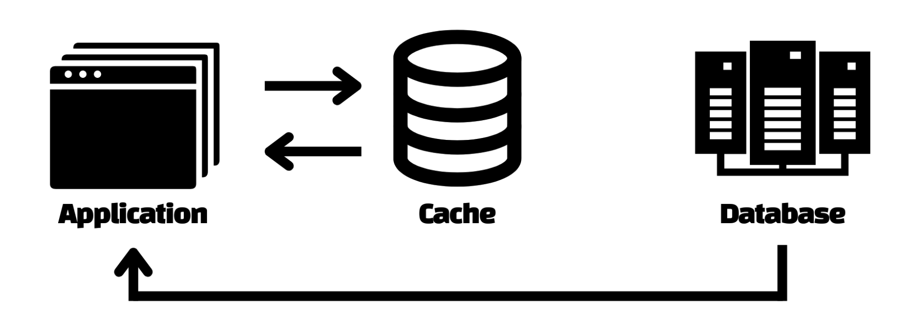
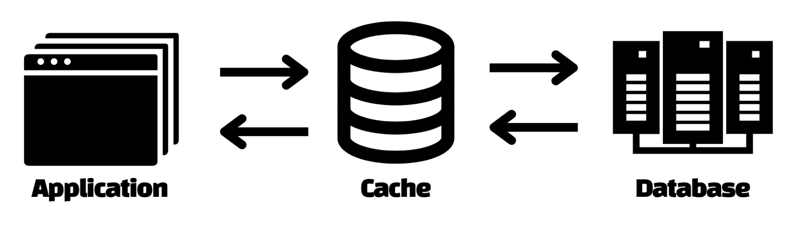
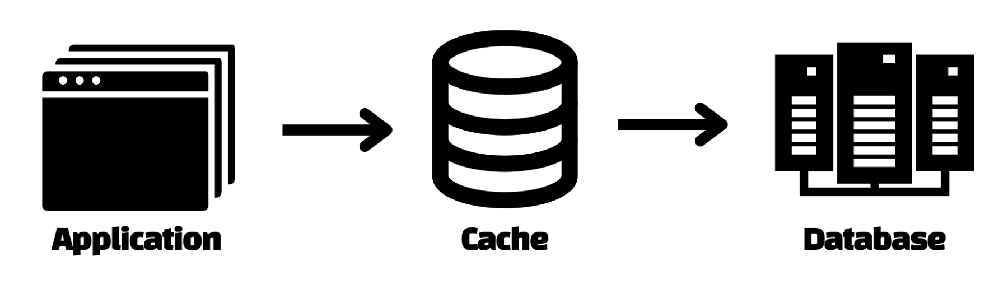

# 동일 데이터의 잦은 조회 - 캐싱 
# INDEX
- [특정 데이터에 대한 반복된 요청을 효과적으로 처리하기 위한 시도](#특정-데이터에-대한-반복된-요청을-효과적으로-처리하기-위한-시도)
- [캐시 사용의 장점](#캐시-사용의-장점)
    - [성능향상](#성능향상)
    - [비용감소](#비용감소)

- [캐시 타입](#캐시-타입)
    - [Cache-aside](#cache-aside)
    - [Read-through/Write-through Cache](#read-throughwrite-through-cache)
    - [Write-behind/write-back Cache](#write-behindwrite-back-cache)

 

---

 

## 특정 데이터에 대한 반복된 요청을 효과적으로 처리하기 위한 시도
캐시(Cache) : 임시로 복제된 데이터를 저장하는 장소
- 사용자가 더 효율적이고 빠르게 원하는 데이터에 접근할 수 있도록 설정
- 원본 데이터베이스가 제공할 수 있는것보다 짧은 대기 시간을 제공
- 웹 애플리케이션의 성능 향상 및 데이터베이스 비용 절감

 

## 캐시 사용의 장점
### 성능향상
- 정보를 제공하는 처리 속도에 집중( 인 메모리 캐시 )
- 사용자의 요청이 반복되는 데이터를 빠르게 제공 
- 애플리케이션 환경 개선

### 비용감소
- 원본 데이터베이스에 대한 쿼리 수 축소

 

## 캐시 타입
### Cache-aside
- 읽기 작업량이 많은 경우 => 애플리케이션을 설계할 때 캐시 보관 패턴 사용
- 데이터가 캐시에 존재하지 않을 경우 데이터베이스에 직접 연결하도록 코드 구성
- 해당 데이터를 캐시에 복사  

  

### Read-through/Write-through Cache  

- '캐시 - 데이터베이스' 일렬 배치, 뒤에 있는 캐시를 주 데이터 저장소 처럼 취급
- 애플리케이션의 읽기 시도 -> 최초 데이터 로드를 위해 캐시가 데이터베이스에 접근 -> 캐시에서 동일 데이터 처리
- 읽기 처리가 많은 워크로드에 적합

  

### Write-behind/write-back Cache  

- 애플리케이션은 일단 캐시에 데이터를 저장
- 캐시가 백그라운드에서 비동기적인 방식으로 데이터베이스에 데이터를 기록
    - 쓰기 완료를 기다릴 필요가 없이 다음 작업 진행 -> 사용자에게 쾌적한 환경 제공 
- 쓰기 처리가 많은 워크로드에 적합

