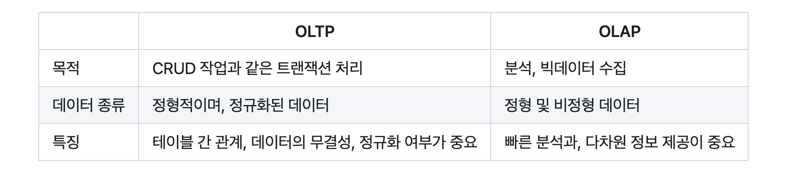
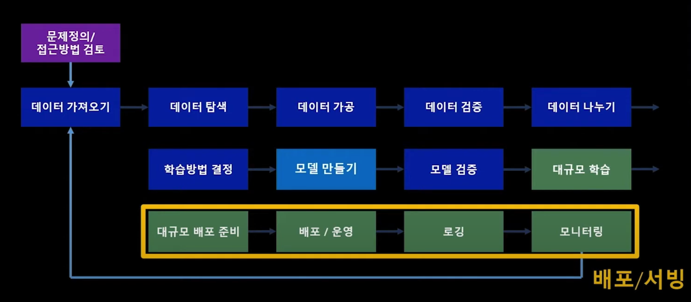
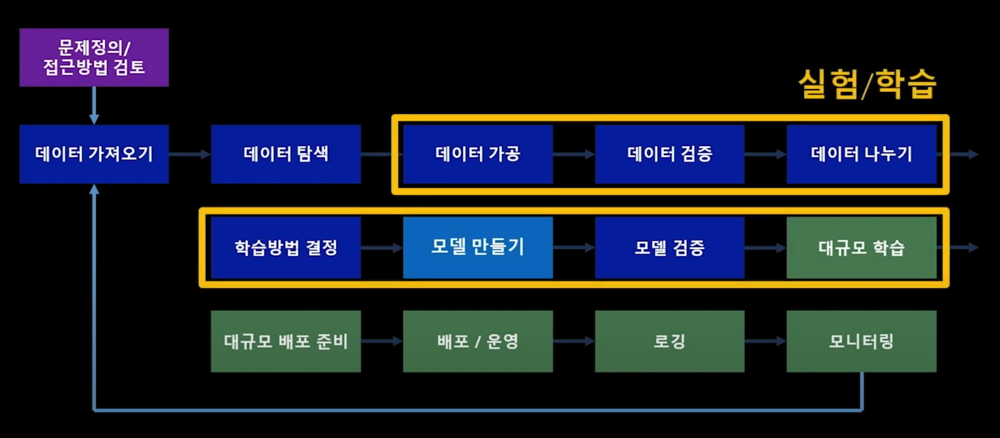

# 데이터 파이프라인과 OLTP vs OLAP
# INDEX
- [데이터 파이프라인](#데이터-파이프라인)
    - [OLTP vs OLAP](#oltp-vs-olap)
- [돌발 퀴즈](#돌발-퀴즈) - 데이터 정규화란 ?
- [ETL과 ELT ( 데이터 파이프라인 )](#etl과-elt--데이터-파이프라인)
    - [ ELT ( 추출 Extract, 적재 Load , 변환 Transform )](#elt--추출-extract-적재-load--변환-transform)
    - [ ELT - ETL : 순서의 차이 ](#elt---etl--순서의-차이)
- [MLOPs](#mlops)  
    - [머신러닝](#머신러닝)
        - [머신러닝을 도입한 데이터 처리 파이프라인](#머신-러닝을-도입한-데이터-처리-파이프라인)  
        === MLOps 전처리 단계 ===  
        [1. 데이터 분석](#1-데이터-분석)  
        [2. 데이터 준비 ( 추출 및 정제 )](#2-데이터-준비--추출-및-정제)  
        [3. 모델 학습 및 튜닝](#3-모델-학습-및-튜닝)  
        [4. 모델 평가 및 검증](#4-모델-평가-및-검증)  
        [5. 모델 제공](#5-모델-제공)  
        [6. 모델 배포 및 모니터링](#6-모델-배포-및-모니터링)  
    - [ML 생애 주기](#ml-생애-주기)
    - [MLOps 전망 및 DevOps와의 비교](#mlops-전망-및-devops와의-비교)
 

---

 

## 데이터 파이프라인
다양한 데이터 소스로 부터 원시 데이터를 수집하여 분석 -> 데이터 웨어하우스 같은 저장소로 이전하는 과정
> 다양한 경로로 부터 수집되는 데이터를 웨어하우스에 적재 -> 효과적으로 분석 ( **MLOps** 를 실천하기 위한 <u>**필수적**</u> 사전 단계)
 

### OLTP vs OLAP
파이프라인을 이용하면서 까지 <u>웨어하우스에 데이터를 중복 저장</u>하고 <u>질의하는 이유</u>는 ?
- OLTP ( Online <u>Transaction</u> Processing ) : 기본적인 CRUD 작업( 트랜잭션 ) 에 포커싱하는 데이터베이스
    - 복잡한 조회로 인해 기본적인 트랜잭션에 성능 상 나쁜 영향을 준다.
- OLAP ( Online Analytical Processing ) : 적재된 데이터를 다양한 방법으로 분석하는데에 포커싱
    - 의사결정 도구 - 다양한 관점의 분석
    - 다양한 데이터 소스로 부터 수집되는 데이터 통합
    - 빠른 분석 <- OLTP의 몇 몇 기능 포기  

     

 
 

# 돌발 퀴즈
## 데이터베이스 정규화란 ? 
## 정형 데이터, 비정형 데이터란 ?
### 정형 데이터
> 정해진 규칙에 따라 구조화된 데이터 ( 날짜, 이름, 주소 등 ), 컬럼 값이 예측 가능하고 의미 파악이 쉬운 데이터
- 적재 데이터가 많을 때, 구조가 바뀌면 모든 정형 데이터를 업데이트 -> 많은 시간과 자원 소모
### 비정형 데이터
> JSON, 텍스트 등의 문서의 형태 혹은 음성이나 영상과 같은 바이너리 형식의 데이터
- 빅테이터 도구를 통해 쉽게 가공/분석 할 수 있게 되었다.
## 정규화 - 정형/비정형 데이터의 개념간 차이

---

 
 

# ETL과 ELT ( 데이터 파이프라인 )
> 한 위치에서 다른 위치로 데이터를 이동하는 두 가지 방법
## ELT ( 추출 Extract, 적재 Load , 변환 Transform )

- 변환 Transform : 비정형 데이터 -> 정형화하는 과정
- 추출 Extract
    - RDBMS
    - NoSQL
    - JSON, log, txt 등 텍스트 파일
    - SaaS로 부터 생성되는 데이터 ( 구글 애즈 )
    - 데이터 레이크( 비정형 데이터를 포함, 원시 데이터를 저장하는 공간 )
- 적재 Load
    - 데이터 웨어하우스

## ELT - ETL : 순서의 차이
- ETL( 추출 - 변환 - 적재 )
    - 소스 시스템에서 데이터를 추출 - 그런 다음 데이터를 대상 시스템과 호환되는 형식으로 변환 - 변환된 데이터를 대상 시스템으로 로드   
    - <u>적재하는 과정</u>에서 변환이 이루어짐
    - ETL로 적재된 데이터는 이미 <u>정형화되어 있기 때문에, 비즈니스 분석이나 시각화에 용이</u>하다.
- ELT( 추출 - 적재 - 변환 )
    - 소스 시스템에서 데이터를 추출 - 변환 없이 - 대상 시스템으로 데이터를 로드 - 데이터 로드 후 SQL 또는 Hadoop과 같은 도구를 사용하여 대상 시스템 내에서 데이터를 변환
    - <u>적재하고 나서</u> 분석을 시작할 떄 변환이 이루어짐
    - 비정형 데이터를 분석 -> 상대적으로 정형화된 데이터 분석보다는 훨씬 느린 비정형 데이터 분석이지만, 최근에는 클라우드의 발전 덕분에 ELT도 빈번하게 사용
    - 현대의 빅데이터 시대에는, 적재하기 전 변환 과정이 오히려 병목이 될 수 있으므로, 이러한 한계를 극복하기 위해 ELT를 사용한다.

 
 

---

# MLOps
> MLOps 파이프라인과 생애주기의 구성만 알면 데브옵스 엔지니어로서 데이터를 운영하는 데 큰 무리가 없다고 한다.

## 머신러닝
- 지도학습으로 미래를 예측하고
- 강화학습으로 반응형 문제를 해결
- 비지도 학습으로 숨겨진 구조를 발견

이 모든 학습의 리소스는 바로 '데이터' => 학습 알고리즘을 바탕으로 머신러닝은 전처리→학습→평가→예측의 순서로 워크플로 시스템을 구축한다.

## MLOps
DevOps를 머신 러닝(Machine Learning) 시스템에 적용한 것
- 실제로 MLOps 파이프라인에서의 <u>모델 검증 및 제공/배포 단계</u>는 마치 DevOps에서 애플리케이션을 <u>테스트하고 배포</u>하는 과정과 흡사하다.

### 머신 러닝을 도입한 데이터 처리 파이프라인
#### 1. 데이터 분석
- 탐색적 데이터 분석 (EDA) - 모델에 필요한 데이터 스키마 및 특성 이해
#### 2. 데이터 준비 ( 추출 및 정제 )
- 데이터 소스로 부터 관련 데이터 추출 (extract) 및 정제
    - 변환(transform), 집합(aggregate), 중복 제거 등
#### 3. 모델 학습 및 튜닝
- 알고리즘 구현, HP 튜닝 및 적용 -> 학습된 모델 결과 도출
#### 4. 모델 평가 및 검증
- 모델의 정확도 수치 확인
- 모델 성능 검증 -> 배포 수준 검증
#### 5. 모델 제공
- CI/CD 툴 사용 -> 파이프라인 자동화
#### 6. 모델 배포 및 모니터링
- 애플리케이션에서 사용 가능하도록 엔드포인트 활성화

===== MLOps의 전처리 종료 =====

| Machine Learning | Develop | Operation |
| --- | --- | --- |
| 비즈니스의 이해 데이터 탐색/가공   초기모델 최적화/평가 | 지속적 통합 - 빌드(모델 최적화)   - 테스트 지속적 전달 - 모델등록 | 지속적 배포 - 서빙 데이터 피드백 루프 -   Data Collection 시스템/모델 모니터링|

 

## ML 생애 주기

 

## MLOps 전망 및 DevOps와의 비교
MLOps : 데이터 수집/분석 + 머신러닝 모델 학습/배포 

| Stage | DevOps                    | MLOps |
|  ---  |  ---                      | ---   |
| Test  | 애플리션 모듈 간의 통합 테스트    | 데이터 검증, 학습된 모델 품질 평가, 모델 검증 |
| Deployment | 프로비저닝 및 애플리케이션 준비 | 학습된 ML 모델 배포 + 새로운 모델이 재학습 되도록 파이프라인 구성
| Operate | 애플리케이션 트래픽, 사용자 등의 모니터링 | 데이터 요약 통계 모니터링 |

|  | DevOps                    | MLOps |
|  ---  |  ---                      | ---   |
| 통합의 대상  | 다양한 코드가 하나의 artifact로 결합되는 통합    | 데이터, 스키마, 모델 테스트를 결합하는 통합 |
| 배포의 대상  | 단일 소프트웨어 패키지의 배포                  | ML 파이프라인 전체를 배포               |
