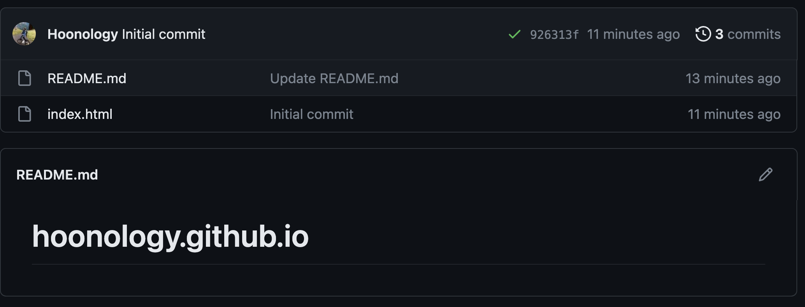
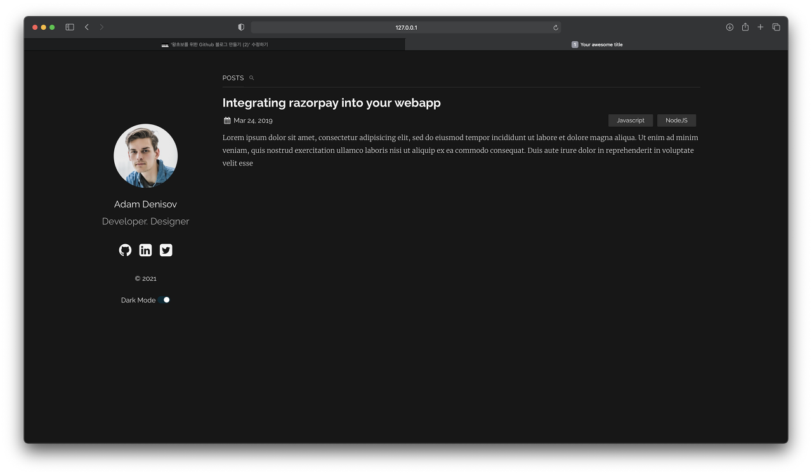
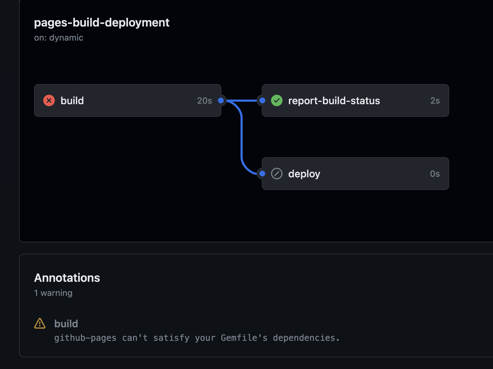

# Github Blog 만들기
# References
- https://zeddios.tistory.com/1222 
- https://choijaegwon.github.io/categories/GitHubBlog
- https://www.irgroup.org/posts/jekyll-chirpy/


# INDEX


---
<br>
<br>

# Github Repo 작업
### 1. 새로운 Repository 생성
- ```username.github.io``` 의 이름으로 레포지토리를 생성한다.
- ```Add a README file``` 체크
### 2. 로컬에 클론
``` bash
git clone https://github.com/username/username.github.io
```

 ### 3. 클론한 폴더의 경로 이동 후 파일 생성 - github와의 연결 확인
```bash
cd username.github.io
echo "Hello World" > index.html

# git add, commit, push
git add .
git commit -m "Initioal commit"
git push -u origin main
```



### 4. 확인   
https://hoonology.github.io 에서 확인  
정상적으로 index.html의 내용이 표시된다.

<br>
<br>

### 5. VScode에 연동시켜준다.

<br>
<br>


# Jekyll


### 0. rbenv 설치
```bash
brew update
brew install rbenv ruby-build
# 버전 확인 
rbenv versions
```

- rbenv PATH를 추가하기 위해 본인의 쉘 설정 파일 (..zshrc, .bashrc) 을 열어 다음의 코드를 추가
    ```bash
    nano ~/.zshrc
    ``` 
- 에디터를 열어 패스 설정
    ``` bash 
    [[ -d ~/.rbenv  ]] && \
    export PATH=${HOME}/.rbenv/bin:${PATH} && \
    eval "$(rbenv init -)"
    ```
- 패스 소스 적용
    ```
    source ~/.zshrc
    ```
- gem install 
    ``` bash
    gem install bundler
    ```


### 1. 로컬에 Jekyll을 설치

```bash
gem install jekyll bundler
```

### 2. index.html 제거
``` bash
rm index.html
```


### 3. Jekyll 버전확인

```bash
jekyll -v
```

### 4. 원격 저장소의 root에 jekyll 저장
```bash
jekyll new ./
```
### 5. 로컬로 서버 띄워보기
```bash
bundle exec jekyll serve
```
http://127.0.0.1:4000 접속 후 정상적으로 나오면,   
https://hoonology.github.io/에 접속해서 같은 창이 나오는지 확인


<br>
<br>


### 6. 스킨 입혀보기
https://github.com/samarsault/plainwhite-jekyll  
이 레포에 있는 것들 모조리 다운로드 한 뒤, 내가 만든 로컬에 덮어쓴다.
- 새로 bundle을 설치한다.
```bash
bundle install
```
### DS_Stroe 뭐라고 뜨면 그냥 없애버려
```bash
find . -name .DS_Store -print0 | xargs -0 git rm --ignore-unmatch -f
echo .DS_Store>>.gitignore
```
- 로컬에서 서버 돌려본다.
```bash
bundle exec jekyll serve
```


깔끔허이.. 잘 쓰겄소

아니다. 난 처피 포기 못해  
https://github.com/cotes2020/jekyll-theme-chirpy  


<br>
<br>


# 블로그 설정

##  ```_congif.yml``` 커스터마이징  
https://www.irgroup.org/posts/jekyll-chirpy/  
이 페이지에 잘 나와있다.

### conf 파일 상세내용
| 항목              | 값                                                      | 설명                                                                                           |
| ----------------- | -------------------------------------------------------- | ---------------------------------------------------------------------------------------------- |
| lang              | ko                                                       | 언어를 한글로 설정합니다. 기본값은 en입니다.                                                 |
| timezone          | Asia/Seoul                                               | 서울 표준시로 설정합니다.                                                                     |
| title             | 아무거나~                                               | 블로그 제목을 넣어 줍니다.                                                                 |
| tagline           | 아무거나~                                               | title 아래에 작은 글씨로 부연설명을 넣을 수 있습니다.                                         |
| description       | 아무거나~                                               | SEO를 위한 키워드들을 입력합니다.                                                             |
| url               | https://focuschange-test.github.io                       | 내 블로그로 실제 접속할 URL을 입력합니다.                                                     |
| github            | github id                                                | 본인의 GitHub 아이디를 입력합니다.                                                            |
| twitter.username | twitter id                                               | 트위터를 사용한다면 아이디를 입력합니다.                                                       |
| social.name       | 이름                                                     | 포스트 등에 표시할 나의 이름을 입력합니다.                                                     |
| social.email      | 이메일                                                   | 나의 이메일 계정을 입력합니다.                                                                 |
| social.links      | 소셜 링크들                                             | 트위터, 페이스북 등 내가 사용하고 있는 소셜 서비스의 나의 홈 URL을 입력합니다.                 |
| theme_mode        | light or dark                                            | 원하는 테마 스킨을 선택합니다. 기본은 light입니다.                                            |
| avatar            | 이미지 경로                                             | 블로그 왼쪽 상단에 표시될 나의 아바타 이미지를 설정합니다.                                    |
| toc               | true                                                     | 포스팅된 글의 오른쪽에 목차를 표시합니다.                                                     |
| paginate          | 10                                                       | 한 목록에 몇 개의 글을 표시해 줄 것인지 선택합니다.                                          |

``` bash
nano .ignore
# 아래 내용 추가 -> ? 빌드/배포 에러 방지하기 위해 올리지 않도록 하는 것
Gemfile.lock
```


# 문제 발생
github에 report build 오류 발생,   

github-pages can't satisfy your Gemfile's dependencies. 라고 떠서 Gemfile을 아래와 같이 수정했다.
```bash
gem "jekyll-theme-chirpy", "~> 4.5"
```

커밋이 되는지 확인  

> 또 뜬다.  

> github-pages can't satisfy your Gemfile's dependencies. 


이 문제를 해결하려면 Gemfile.lock에서 github-pages 버전과 호환되는 jekyll-theme-chirpy의 하위 버전을 지정해 보세요. 또는 github-pages의 로컬 버전을 jekyll-theme-chirpy 버전 4.5와 호환되는 버전으로 업데이트할 수 있습니다. bundle update를 실행하여 모든 gem을 최신 호환 버전으로 업데이트할 수도 있습니다.


--------

망할 저 스킨 안쓸게요

다른 스킨 이용합니다.


https://codesyun.tistory.com/102#--%--%ED%--%-C%EB%A-%--%EB%B-%--%--%EC%--%B-%EB%B-%--%EC%--%AC%ED%--%AD%--%EB%B-%--%EA%B-%BD

그냥 이 사람꺼 보고 다 읽으면 해결됩니다.


