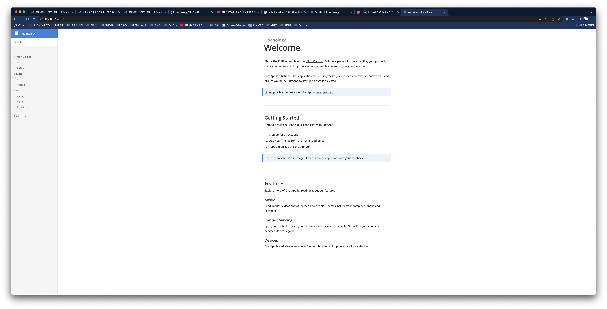
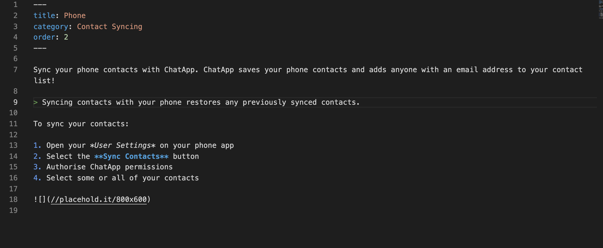
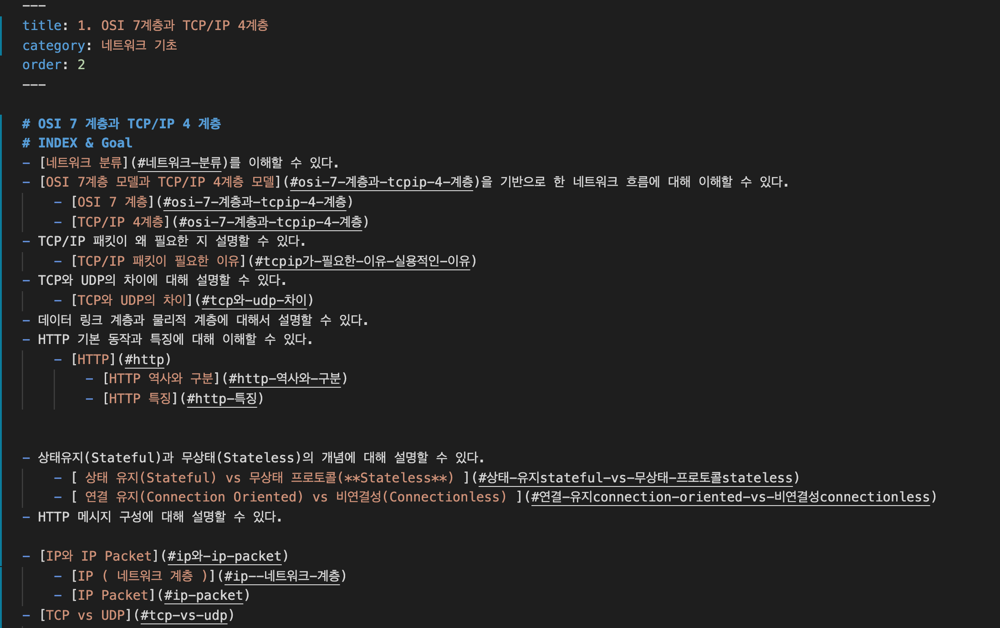
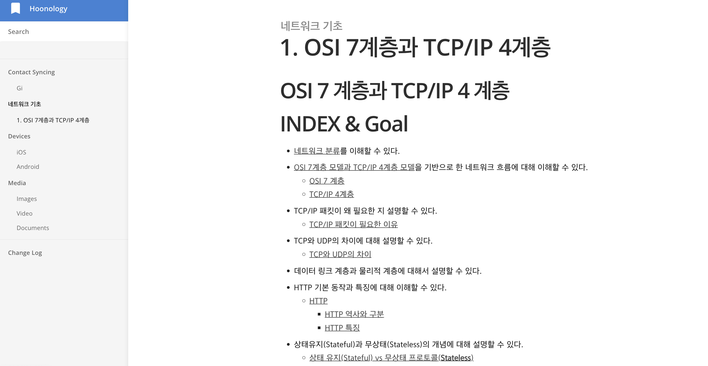

# 회고
깃허브 블로그가 만들기 정말 어렵다고 생각했다. . .  
그래도 깃허브 블로그를 만드려는 목적이 무엇이냐, 내 TIL을 적음으로써 ! IT 인재가 되기 위해 지식의 밑천을 까는 (사실 잔디를) 것 아니었나 !  
시도를 하면서 그래도 깃허브에 대한 이모저모를 뼈로 느껴보는 시간이 되었다.  

<br>

# 새로운 테마로 
결국 내가 택한 테마는 처피 테마 보다 훨씬 간단한 테마이다.  
해당 테마에서 기본적으로 구현해주는 검색 기능에 기대가 컸기에 내 블로그 테마로 골랐다.
- 검색기능 
    > 이게 가장 나에게 필요했다.   
    내가 쓴 글을 한 파일 한 파일 열어보지 않아도 된다는 것이 가장 큰 매리트이다.  
    어떤 말을 어디에 썼는지 모르면 자료 찾는 시간이 꽤나 걸리기 때문이다.  
    티스토리나 velog, 네이버 블로그는 기본적으로 제공해주는 기능이지만 깃허브 블로그에서는 직접 구현하거나 이러한 모델을 사용해야한다.

    
    - 좌측에 나의 글 목록이 한 눈에 들어온다.
      > 너무 심플하여 향후 커스터마이징 할 예정


    게시물 ```Contact Syncing - Phone``` 을 열어서 살펴보면 프론트 구성은 아래와 같다.
    

    이번엔 마크다운 파일을 살펴본다. 1 대 1 비교를 통해 글을 수정해보며 바로 반영되는지 확인해본다. 

    

## Try

### 로컬 환경에서 수정하며 실시간 변화를 살펴본다.
1. 가상 서버 실행
    ```bash 
    bundle exec jekyll serve
    ```
2. 게시물 수정
    
    
