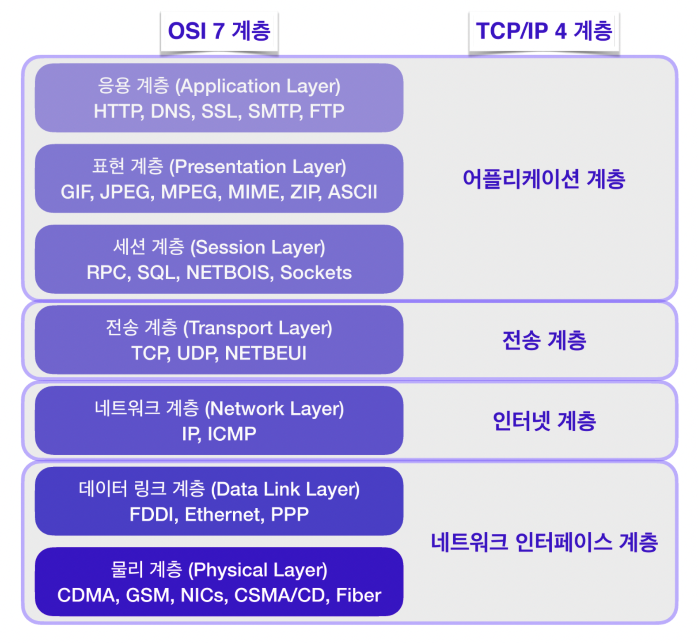
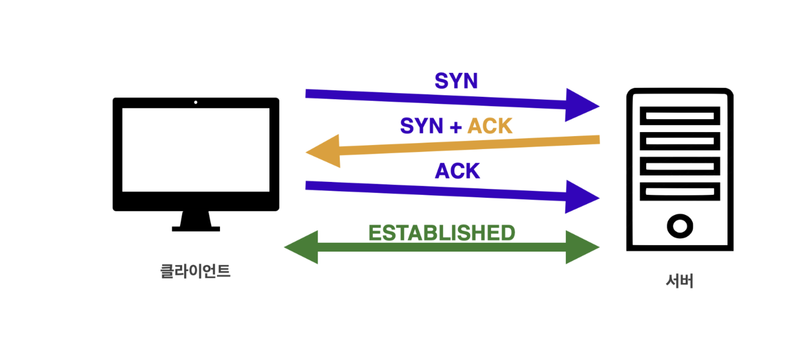

# OSI 7 계층과 TCP/IP 4 계층
# INDEX & Goal
- [네트워크 분류](#네트워크-분류)를 이해할 수 있다.
- [OSI 7계층 모델과 TCP/IP 4계층 모델](#osi-7-계층과-tcpip-4-계층)을 기반으로 한 네트워크 흐름에 대해 이해할 수 있다.
    - [OSI 7 계층](#osi-7-계층과-tcpip-4-계층)
    - [TCP/IP 4계층](#osi-7-계층과-tcpip-4-계층)
- TCP/IP 패킷이 왜 필요한 지 설명할 수 있다.
    - [TCP/IP 패킷이 필요한 이유](#tcpip가-필요한-이유-실용적인-이유)
- TCP와 UDP의 차이에 대해 설명할 수 있다.
    - [TCP와 UDP의 차이](#tcp와-udp-차이)
- 데이터 링크 계층과 물리적 계층에 대해서 설명할 수 있다.
- HTTP 기본 동작과 특징에 대해 이해할 수 있다.
    - [HTTP](#http)
        - [HTTP 역사와 구분](#http-역사와-구분)
        - [HTTP 특징](#http-특징)

            
- 상태유지(Stateful)과 무상태(Stateless)의 개념에 대해 설명할 수 있다.
    - [ 상태 유지(Stateful) vs 무상태 프로토콜(**Stateless**) ](#상태-유지stateful-vs-무상태-프로토콜stateless)
    - [ 연결 유지(Connection Oriented) vs 비연결성(Connectionless) ](#연결-유지connection-oriented-vs-비연결성connectionless)
- HTTP 메시지 구성에 대해 설명할 수 있다.

- [IP와 IP Packet](#ip와-ip-packet)
    - [IP ( 네트워크 계층 )](#ip--네트워크-계층)
    - [IP Packet](#ip-packet)
- [TCP vs UDP](#tcp-vs-udp)
    - [TCP와 IP의 패킷 정보](#tcpip-패킷-정보)
    - [TCP (전송 제어 프로토콜)](#tcp-전송-제어-프로토콜)
    - [TCP : IP 보다 한 차원 높은 계층 ( 전송 계층 )](#tcp--ip-보다-한-차원-높은-계층--전송-계층)
    - [UDP](#udp)
    - [TCP vs UDP](#tcp-vs-udp-1)

- [정리](#정리)
- [References](#references) (영상 자료 첨부)
---
 

복잡한 네트워크의 이해에 도움이 되는 단계적인 계층을 필수적으로 학습해야한다.

# 네트워크 분류
- LAN : ***1km 내 근거리 통신망***, 로컬 영역 네트워크, 구내 정보 통신망은 네트워크 매체를 이용하여 집, 사무실, 학교 등의 건물과 같은 가까운 지역을 한데 묶는 컴퓨터 네트워크이다. 이와 대조적으로 광역 통신망은 더 넓은 지역 범위를 아우를뿐 아니라 일반적으로 전용선 또한 동반한다.
- WAN (Wide Area Network) : ***LAN 을 연결한 넓은 지역의 광역 네트워크***, 광역 통신망은 드넓은 지리적 거리/장소를 넘나드는 통신 네트워크 또는 컴퓨터 네트워크이다. 광역 통신망은 종종 전용선과 함께 구성된다. 사업, 교육, 정부 기관들은 광역 통신망을 사용하여 세계의 다양한 지역의 직원, 학생, 고객, 구매자, 공급자에게 데이터를 중계한다.

- Star형 네트워크
    - 중앙에 한 개의 중앙 노드 또는 서버가 있고, 이 중앙 노드를 중심으로 다수의 클라이언트 또는 터미널 노드가 연결되어 있는 네트워크 구조. 일반적으로 작은 규모의 네트워크에서 사용한다.
- Mesh형 네트워크
    - 노드 간에 직접 연결되어 구성되는 분산 네트워크

---
 

# OSI 7 계층과 TCP/IP 4 계층
## 통신용 규약 표준화
과거에는 통신용 규약이 표준화 되지 않아서 각 벤더에서 별도로 개발을 했기에 서로 호환되지 않는 시스템과 애플리케이션이 많았으며 통신에 제약이 많았다.
> ARPANET 에서 TCP/IP 4계층 정리 + OSI 7계층으로 세분화하면서 네트워크의 동작을 나누어 설명한다.

### OSI 7 계층 (이론적인 내용)

- 애플리케이션(응용) 계층 : 애플리케이션 프로세스를 정의하고, 애플리케이션 서비스를 수행한다.

- 프레젠테이션(표현) 계층 : 이 계층에서는 일종의 변역기 같은 역할을 수행, MIME 인코딩이나 암호화, 압축, 코드 변환과 같은 동작을 한다.

- 세션 계층 : 양 끝 단의 프로세스가 연결을 성립하도록 도와주고, 작업을 마친 후에는 연결을 끊는 역할을 한다.

- 전송 계층 : 하위 계층에서 신호와 데이터를 올바른 위치로 보내고 신호를 만드는데 집중했다면, 전송 계층에서는 해당 데이터들이 실제로 정상적으로 보내지는지 확인하는 역할을 한다. 네트워크 계층에서 사용되는 패킷은 유실되거나 순서가 바뀌는 경우가 있는 데, 이를 바로 잡아주는 역할도 담당한다.

- 네트워크 계층 : **IP주소와 같은 논리적인 주소를 정의**합니다. 또한 라우터를 통해 정의한 IP주소를 이해하고, 이를 사용해 최적의 경로를 찾아 패킷을 전송합니다.

- 데이터 링크 계층 : 물리 계층에서 들어온 전기 신호를 모아 알아 볼 수 있는 데이터 형태로 처리 합니다. 이 계층에서는 **주소 정보를 정의하고 출발지와 도착지 주소를 확인한 후**, **데이터 처리를 수행한다**.

- 물리 계층 : 주로 물리적 연결과 관련된 정보를 정의한다. 들어온 전기 신호를 그대로 잘 전달하는 목적이 있다.

 
---
# HTTP
## HTTP 역사와 구분

- TCP 기반 : HTTP/1.1, HTTP/2
- UDP 기반 : HTTP/3

## HTTP 특징

- HTTP 메시지
- 단순함, 확장 가능
- 클라이언트 서버 구조
    - Req - Res 구조
    - <u>무상태 프로토콜(**Stateless**)</u>, <u>비연결성(**Connectionless**)</u>

### 상태 유지(Stateful) vs 무상태 프로토콜(**Stateless**)
- 무상태 프로토콜 : 서버가 클라이언트의 상태를 보존하지 않는다.
    - Pros : 서버의 확장성 높다.(스케일 아웃)
    - Cons
        - 클라이언트가 추가 데이터를 전송해야하는 번거로움이 있다.
        - 로그인이 필요한 서비스라면 유저의 상태를 유지해야 되기 때문에 브라우저 쿠키, 서버 세션, 토큰 등을 이용해 상태를 유지한다.
            

    예시로 쉽게 설명하겠다.
    -   > ***Stateful***일 경우,  
    쉽게 설명하면 내가 요청을 하는 입장에서 모든 것을 기억한 상대가 맥락을 연결해서 대답해주는 것  
        🙋🏻‍♂️ : 카푸치노 2잔 얼마에요 ? 💁🏼‍♀️ : 4천원입니다.  
        🙋🏻‍♂️ : 2잔 주세요 💁🏼‍♀️ : 결제 방식은 어떻게 되시나요?  
        🙋🏻‍♂️ : 카드  💁🏼‍♀️ : 4천원 결제 됐어요  
        - 상태 유지가 되어야 하는 프로토콜이라면 클라이언트의 요청을 기억하고 있는 항상 서버 1이 응답해야한다.
            - 서버 1이 고장나면 상태 정보가 다 사라지니깐, 처음 부터 다시 서버에 요청한다.

    -   > ***Stateless***일 경우,  
        상대가 요청을 다 기억은 못해서 하나 하나 맥락을 내가 이어야한다.    
        🙋🏻‍♂️ : 카푸치노 2잔 얼마에요 ? 💁🏼‍♀️ : 카푸치노는 4천원입니다.  
        🙋🏻‍♂️ : 카푸치노 2잔 주세요 💁🏻 : 카푸치노는 4천원 입니다. 결제 방식은 어떻게 되시나요?  
        🙋🏻‍♂️ : 카푸치노 2잔을 신용카드로 결제 할게요  💁🏿‍♂️ : 4천원 결제 됐어요  

        - 클라이언트가 필요한 데이터를 다 담아서 전송하기 때문에 아무 서버나 호출해도 된다.
            - 서버 1이 고장나도 다른 서버에서 응답을 전달하기 때문에 클라이언트가 다시 요청할 필요가 사라진다.
        - ***응답 서버를 쉽게 바꿀 수 있는 이러한 이유들 때문에 무한한 서버 증설 가능***

### 연결 유지(Connection Oriented) vs 비연결성(Connectionless)  
- 연결유지 ( TCP/IP ) : 연결을 유지하는 모델에서는 요청을 보내지 않더라도 계속 연결을 유지
    - 서버의 자원이 계속 소모
- 비연결성 ( HTTP ) : 실제로 요청을 주고 받을 때만 연결 유지, 응답 후 TCP/IP 연결 해제, 트래픽이 많지 않고, 빠른 응답을 제공하는 경우에 쓰임
    - Pros
        - 최소한의 자원으로 서버를 유지 ( 효율적 )
    - Cons
        - 웹 브라우저에 요청할 경우 HTML, CSS, JavaScript, 추가 이미지 등 자원이 함께 다운로드 된다.
        - (과거 HTTP 초기 모델)해당 자원들을 각각 보낼 때마다 연결 끊고 다시 연결하고를 반복하는 것은 비효율적이기 때문에   
            (현재) HTTP 지속 연결(Persistent Connections)로 문제를 해결한다.

 

---

# IP와 IP Packet
## IP ( 네트워크 계층 )
IP 주소를 컴퓨터에 부여해 노드들(서버)을 지나 클라이언트와 서버가 소통한다.
- IP는 IP 주소에 Packet이라는 통신 단위로 데이터를 전달한다.
## IP Packet
- Packet = Pack + bucket
- 데이터 통신에 포장하여 적용한 것 ( 출발지 IP <-> 도착지 IP) : 정확한 목적지로 패킷 전송 가능(Req <-> Res)
- 한계점
    - 비연결성 : 패킷의 대상이 없거나 서비스 불능 상태여도 패킷 전송
        - 클라이언트는 서버의 상태를 파악할 수 없기 때문
    - 비신뢰성 : 패킷이 사라지거나 패킷의 순서를 보장 받을 수 없다.
        - 마찬가지로 클라이언트는 알지 못하기 때문
        - 전달 데이터 용량이 클 경우 패킷 단위로 데이터를 전달할 경우에 중간에 서로 다른 노드를 통해 전달될 수 있다. 그렇기 때문에 의도치 않은 순서로 서버에 도착 우려

 

# TCP vs UDP        
IP 패킷의 위와 같은 한계점이 있기 때문에 네트워크 계층 구조에서 보완할 수 있는 방법이 있다.

- 유저가 채팅 프로그램에서 Hello, World 메시지를 작성합니다.
- 애플리케이션 계층에서 HTTP 메시지에 해당 메시지(Hello, World)가 담겨 전송됩니다. 
- 전송 계층에서 TCP 세그먼트를 생성하고, 인터넷 계층에서 IP 패킷으로 만들어집니다. 
- 생성된 IP 패킷은 물리적 계층을 지나기 위해서 이더넷 프레임 워크에 포함되어 서버로 전송됩니다. 

HTTP 메시지 생성 -> **Socket**(네트워크 환경에 연결할 수 있게 만들어진 연결부)을 통해 전달

## TCP/IP 패킷 정보
- TCP 패킷 : 출발지 PORT, 목적지PORT, 전송제어. 순서 검증 정보 (IP 패킷 보완)
- IP 패킷 : IP 패킷의 출발지 IP, 목적지 IP

## TCP (전송 제어 프로토콜)
- 연결 지향 (3 way handshake)
    - 
    - 클라이언트가 서버에 SYN 패킷 전송 -> 서버가 클라이언트에게 ACK(수락) + SYN 패킷 전송 -> 클라이언트가 서버에게 ACK 패킷 전송  -> 연결 성립
- 데이터 전달 보증
    - 
    - 데이터 전송과 응답이 성공적으로 이루어짐으로써 IP 패킷의 한계인 비연결성 보완 

- 순서 보장
    - 패킷의 순서가 섞여 도착하면 TCP 세그먼트에 있는 정보를 토대로 다시 패킷 전송 요청 -> IP 패킷의 비신뢰성 보완
- 신뢰할 수 있는 프로토콜

## TCP : IP 보다 한 차원 높은 계층 ( 전송 계층 )
네트워크 프로토콜 계층은 OSI 7계층과 TCP/IP 4 계층으로 나눌 수 있다고 앞서 설명했다.
IP 프로토콜 보다 더 높은 계층에 TCP 프로토콜이 존재하기 때문에 앞서 다룬 IP 프로토콜의 한계를 보완할 수 있다.
 

## UDP
사용자 데이터그램 프로토콜
- IP 프로토콜 + PORT, 체크섬( 중복 검사 ) 필드 정보
- TCP와는 다르게 3 way handshake를 사용하지 않아 빠른 속도 보장 ( 신뢰성은 낮음 )
- HTTP/3 에서 사용
    - 여러 기능이 구현된 TCP와는 다르게 커스터마이징 가능

> TCP : 무거운 라이브러리  
UDP : 가벼운 라이브러리

 

### TCP vs UDP

| TCP | UDP |
| --- | --- |
| 연결지향형 | 비 연결지향형
| 전송 순서 보장 | 전송 순서 보장 X |
| 데이터 수신 여부 확인 | 데이터 수신 여부 확인 X |
| 신뢰성이 높지만 속도는 느림 | 신뢰성은 낮지만 속도는 빠름 |

 
 

# 정리 

### TCP/IP가 필요한 이유 (실용적인 이유)
***서로 다른 네트워크 장치 간 통신에 필요***하다.  
- 현대의 네트워크엔 OSI 7 계층 보다 합리적이고 성능이 우수한 TCP/IP 프로토콜과 이더넷으로 이루어진다.
이를 통해 데이터를 네트워크를 통해 전송할 수 있는 패킷이라는 더 작고 관리 가능한 조각으로 나눌 수 있다. 패킷이 없으면 데이터를 연속 스트림으로 전송해야 하므로 관리가 어렵고 오류가 발생하기 쉽다.
- 데이터가 네트워크를 통해 안정적으로 전송되도록 하는 방법 제공
    - 패킷 : 보내는 사람, 받는 사람 및 패킷 조립 순서 정보 포함
    - 패킷 손실이나 손상된 경우 수신자는 누락된 패킷을 재전송하도록 요청 가능
- 목적지에 도달하기 위해 여러 장치와 네트워크를 통해 라우팅

 

### TCP와 UDP 차이
> TCP(전송 제어 프로토콜) 및 UDP(사용자 데이터그램 프로토콜)는 네트워크를 통해 데이터를 전송하는 데 사용되는 두 가지 전송 계층 프로토콜입니다.  

- TCP는 데이터를 전송하기 전에 장치 간에 안정적인 연결을 설정하는 연결 지향 프로토콜입니다. 
    - TCP는 데이터가 올바른 순서로 오류 없이 전송되도록 보장합니다. 오류 검사, 흐름 제어 및 혼잡 제어를 수행하여 데이터가 네트워크를 통해 안정적으로 전송되도록 합니다. 그러나 이러한 안정성은 UDP에 비해 오버헤드가 증가하고 속도가 느려지는 대가로 발생합니다.
    
- UDP는 데이터를 전송하기 전에 연결을 설정하지 않는 연결 없는 프로토콜입니다. 오버헤드가 적고 동일한 수준의 오류 검사 및 흐름 제어를 수행하지 않기 때문에 TCP보다 빠르고 효율적입니다. 
    - UDP는 안정성보다 속도가 더 중요한 온라인 게임 및 스트리밍 미디어와 같은 실시간 애플리케이션에 일반적으로 사용됩니다.
    
> 요약하면 TCP는 데이터를 전송하기 전에 연결을 설정하는 안정적이지만 느린 프로토콜인 반면 UDP는 데이터를 전송하기 전에 연결을 설정하지 않는 더 빠르지만 덜 안정적인 프로토콜입니다. TCP와 UDP 사이의 선택은 응용 프로그램의 특정 요구 사항과 안정성과 속도 간의 균형에 따라 달라집니다.

 
 

# References
- OSI 7 Layer https://youtu.be/1pfTxp25MA8