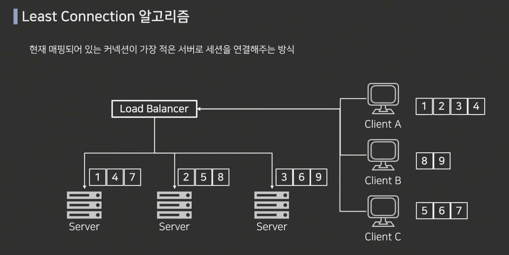
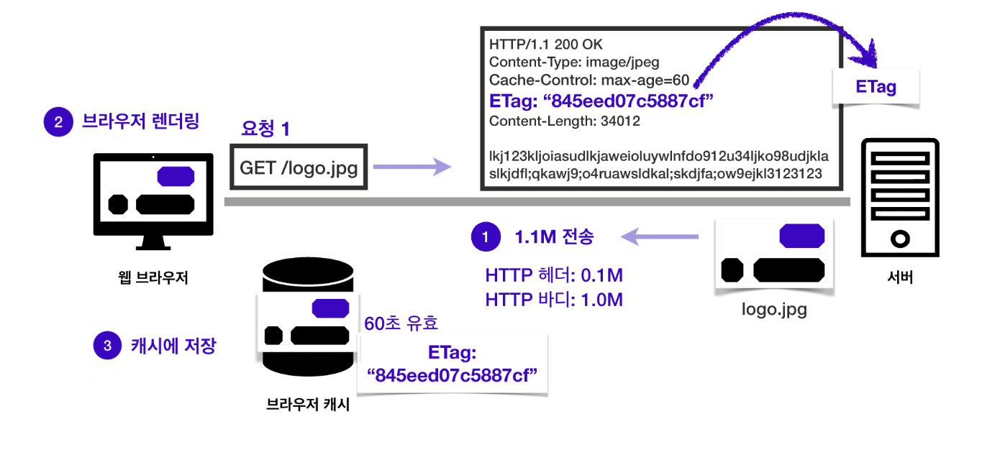

# INDEX
- [프록시란](#프록시란)
    - [프록시 종류](#프록시-종류)
- [로드 밸런서](#로드밸런서-load-balancer)
    - [로드 밸런서 역할](#로드밸런서-역할)
    - [계층별 로드 밸런서](#계층별-로드-밸런서)

- [캐시](#캐시의-기본-원리-및-적용)
    - [캐시의 기본원리 및 적용](#캐시의-기본-원리-및-적용)
    - [검증 헤더와 조건부 요청](#검증-헤더와-조건부-요청)
    - [ETag와 If None Match](#etag와-if-none-match)
    - [Cache-Control(캐시 지시어)](#cache-control--캐시-지시어)
- [프록시 캐시](#프록시-캐시)
    - [원 서버 직접 접근](#원-서버origin-직접-접근)
    - [Proxy Cache-Control(캐시 지시어)](#proxy-cache-control-캐시-지시어)
    - [캐시 무효화](#캐시-무효화)
        - [Cache-Control (캐시 지시어) - 캐시 무효화 헤더 _ Directives](#cache-control캐시-지시어---캐시-무효화-헤더directives)
---

<br>

# 프록시
> '대리, 대리권'  
프록시는 애플리케이션 계층, 전송 계층 및 네트워크 계층을 포함하여 네트워크 스택의 다양한 계층에서 구현될 수 있습니다. 웹 개발에서 프록시는 종종 프런트엔드 클라이언트와 백엔드 서버 간에 요청을 라우팅하거나 추가 보안 및 성능 최적화를 제공하는 데 사용됩니다.


- 프록시 서버 : 원 서버를 대리하여 통신
    - 캐시, 로드밸런서, 보안 등 중계 역할 담당하는 서버
        - 캐싱: 프록시는 서버의 응답을 캐시할 수 있으므로 클라이언트가 동일한 리소스를 다시 요청하면 프록시가 서버에 요청을 전달하는 대신 캐시된 응답을 반환할 수 있습니다. 이를 통해 네트워크 트래픽을 줄이고 성능을 향상시킬 수 있습니다.  
        - 보안: 프록시는 클라이언트와 서버 간의 보안 장벽 역할을 할 수 있으며 요청과 응답을 필터링하여 무단 액세스를 방지하고 공격으로부터 보호할 수 있습니다. 
        - 익명성: 프록시는 클라이언트의 요청을 서버로 중계하고 클라이언트의 IP 주소 또는 기타 식별 정보를 공개하지 않고 응답을 반환함으로써 서버에서 클라이언트의 신원을 숨기는 데 사용할 수 있습니다.

> 👨🏻‍💻(클라) -  ⚯(프록시) - 🖲️(서버)  
 클라이언트 입장에서 프록시 : 서버  
 서버 입장에서 프록시 : 클라이언트
- 위치에 따른 구분
    - 포워드 프록시 ( 클라이언트 대리 - 프록시를 통해 리소스 요청 )
    - 리버스 프록시 ( 서버 대리 - 프록시를 통해 리소스 전달 )
        - 클라이언트와 서버 사이에 있는 일종의 프록시 서버이며 서버를 대신하여 클라이언트의 요청을 수신하고 응답합니다. 클라이언트와 서버 그룹 사이에 있는 기존 정방향 프록시와 달리 역방향 프록시는 단일 서버 또는 서버 그룹과 연결됩니다.
        - **주요 목적**은 클라이언트와 서버 사이에 추상화 계층을 제공하여 서버의 성능, **보안 및 안정성을 향상**시키는 것입니다. 클라이언트의 요청을 처리하고 적절한 서버로 전달함으로써 리버스 프록시는 다음을 수행할 수 있습니다.
            - **성능과 확장성을 개선**하기 위해 여러 서버에 **트래픽 부하를 분산**합니다.
            - 서버 부하를 줄이고 응답 시간을 개선하기 위해 응답을 캐시합니다.
            - **악성 트래픽을 필터링**하고 차단하여 공격으로부터 **서버를 보호**합니다.
            - SSL 암호화가 서버에서 리버스 프록시로 오프로드될 수 있도록 SSL 종료를 제공합니다.

> 리버스 프록시는 애플리케이션 계층, 전송 계층 및 네트워크 계층을 포함하여 네트워크 스택의 다양한 계층에 배포할 수 있습니다. 일반적으로 웹 애플리케이션에서 들어오는 트래픽에 대한 단일 진입점을 제공하고 서버 클러스터 전체에 트래픽을 분산시키는 데 사용됩니다.

### 프록시 종류
- 순방향 프록시: 순방향 프록시는 클라이언트와 서버 그룹 사이에 위치하며 클라이언트의 요청을 적절한 서버로 전달합니다. 정방향 프록시를 사용하여 응답을 필터링 및 캐시하고 클라이언트의 IP 주소를 숨김으로써 익명성을 제공할 수 있습니다.
- 리버스 프록시: 리버스 프록시는 클라이언트와 서버 또는 서버 그룹 사이에 위치하며 서버를 대신하여 클라이언트의 요청을 수신하고 응답합니다. 리버스 프록시를 사용하여 트래픽 부하를 분산하고 응답을 캐시하고 SSL 종료를 제공할 수 있습니다.
- 투명 프록시: 투명 프록시는 네트워크 트래픽을 수정하지 않고 가로채며 관리자가 정의한 규칙에 따라 요청을 필터링하고 차단하는 데 사용할 수 있습니다.
- 익명 프록시: 익명 프록시는 클라이언트의 IP 주소 및 기타 식별 정보를 서버에서 숨겨 클라이언트에게 프라이버시 계층을 제공합니다.

프록시 서버는 응용 프로그램 계층, 전송 계층 및 네트워크 계층을 포함하여 네트워크 스택의 다양한 계층에 배포할 수 있습니다. 성능, 보안 및 개인 정보 보호를 개선하기 위해 웹 애플리케이션에서 일반적으로 사용되며 방화벽 또는 기타 보안 수단으로 제한되는 리소스에 대한 액세스를 제공하는 데에도 사용할 수 있습니다.
### References
1. https://simplicable.com/IT/proxy-server  
2. https://simplicable.com/IT/reverse-proxy

<br>

## 로드밸런서( Load Balancer )
한 대의 서버만 있을 경우, 서비스 규모가 커지면 모든 서비스를 수용하기 어려워진다. 장애 발생 시 단일 서버에서는 정상적인 서비스를 제공하기 어렵다.  
> 서비스 가용성(avaliability) 을 높이기 위해 두 대 이상의 서버를 구성 -> 여전히 서비스 문제가 발생할 우려가 있다.

이에 로드 밸런서를 사용한다.  
> 로드 밸런서 : 들어오는 네트워크 트래픽을 서버 또는 리소스 그룹에 분산시키는 네트워크 장치 또는 소프트웨어 유형이며, 로드 밸런서의 주요 목적은 들어오는 요청을 여러 서버 또는 리소스에 고르게 분산하여 애플리케이션 또는 서비스의 성능, 가용성 및 확장성을 개선한다.


### 로드밸런서 역할
- Health Check : 서버가 정상적으로 살아있는지 확인 ( L4, L7의 기능을 갖기 때문에 포트로 체크하는 경우가 많다. )
- 알고리즘에 따른 분산 처리



- 성능 향상: 로드 밸런서는 여러 서버 또는 리소스에 트래픽을 분산하여 단일 서버의 로드를 줄이고 응답 시간을 개선할 수 있습니다.
- 가용성 증가: 로드 밸런서는 문제가 있는 서버 또는 리소스에서 트래픽을 감지하고 리디렉션하여 애플리케이션 또는 서비스의 전반적인 가용성을 향상시킬 수 있습니다.
- 확장성: 로드 밸런서 풀에 더 많은 서버 또는 리소스를 추가하면 애플리케이션 또는 서비스를 수평으로 확장하여 더 많은 트래픽을 처리할 수 있습니다.
- 보안: 로드 밸런서는 악의적인 트래픽을 필터링하고 차단하여 분산 서비스 거부(DDoS) 공격과 같은 일반적인 공격으로부터 보호하는 데 사용할 수 있습니다

### 계층별 로드 밸런서
 OSI 7계층 모델을 기준으로 보통 4계층과 7계층으로 나뉨
 - L4 로드 밸런서 : 일반적인 로드 밸런서가 동작하는 방식입니다. TCP, UDP 정보(특히 포트넘버)를 기반으로 로드 밸런싱을 수행합니다. 이 때, 부하를 분산하는 기능 뿐만 아니라, TCP 계층에서의 최적화와 보안 기능을 함께 제공합니다. 그러나 최근 사용되는 로드 밸런서는 4계층과 7계층의 기능을 모두 지원하기 때문에 4계층 로드밸런싱만 제공하는 경우는 찾기 어렵습니다.
 - L7 로드 밸런서 : HTTP, FTP, SMTP와 같은 애플리케이션 프로토콜 정보를 기반으로 로드 밸런싱을 수행합니다. 이 때 HTTP 헤더 정보나 URI와 같은 정보를 기반으로 프로토콜을 이해한 후 부하를 분산합니다. 일반적으로 이런 장비를 ADC(Application Delivery Controller)라고 부르며 리버스 프록시 역할을 수행합니다. 대부분의 L7 로드밸런서는 4계층에서 7계층까지 로드밸런싱 기능을 제공하며, 장애극복(Failover), 리다이렉션의 기능도 함께 수행합니다.

 <br>

# 캐시
## 캐시의 기본 원리 및 적용
 캐시 : 캐시(cache)는 컴퓨터 과학에서 데이터나 값을 미리 복사해 놓는 임시 장소를 가리킨다.  
 - 캐시가 없는 일반적인 경우 : 👨🏻‍💻 이미지 전송 <->응답  {헤더, 바디} 🖲️
    - 같은 데이터를 요청하고 네트워크를 통해 같은 데이터 또 다운로드 ( 용량 문제가 생길 우려가 있음 )

 - 캐시의 접근 시간에 비해 원래 데이터를 접근하는 시간이 오래 걸리는 경우나 값을 다시 계산하는 시간을 절약하고 싶은 경우에 사용
 - 캐시에 데이터를 미리 복사해 놓으면 계산이나 접근 시간 없이 더 빠른 속도로 데이터에 접근     
 > 브라우저에 캐시를 저장할 땐 헤더에 cache-control 속성을 통해 캐시가 유효한 시간을 지정할 수 있다.   
이 경우 60초로 설정한다면 60초 동안은 해당 캐시가 유효하다는 의미가 된다.  

> 두 번째 요청에서 캐시 우선 조회 : 60초가 지나지 않아 유효한 캐시면, 캐시에서 데이터를 가져온다.  
( 유효 시간이 지나면 네트워크 다운로드 재시작 )
-> 기존 캐시 삭제 후 새 캐시로 데이터 업데이트

<br>

## 검증 헤더와 조건부 요청
### ❓
캐시 유효시간이 지났지만 변경이 없어서 데이터를 그냥 써도 되는 상황이라면 어떻게 검증하고 사용할까?
> 검증 헤더 ```Last Modified```를 통해 캐시 수정시간을 알 수 있다. ( 데이터가 마지막으로 수정된 시간 정보를 헤더에 포함 )

(출처 : Codestates)  
캐시 유효시간 초과 시, ```If-Modified-Since``` 헤더를 통해 조건부 요청을 한다.

(출처 : Codestates)

- 문제 

A.
캐시 유효기간이 지난 이후에는 Last-Modified, If-Modified-Since와 ETag, If-None-Match 두 쌍의 헤더를 통해, 검증하고 사용할 수 있습니다.


B.
Last Modified는 데이터가 마지막으로 수정된 시간 정보를 헤더에 포함하며, 응답 결과를 캐시에 저장할 때 데이터 최종 수정일도 저장됩니다.

정답

C.
***If-None-Match를 요청 헤더에 작성하여 보내면, ETag 값을 검증하고 수정되지 않았다면 응답 결과를 새로 받아오고, 헤더 데이터를 재사용 합니다.***

D.
서버에서 완전히 캐시를 컨트롤하고 싶은 경우 ETag를 사용할 수 있습니다.

해설  
If-None-Match를 요청 헤더에 작성하여 보내면, ETag 값을 검증하고 수정되지 않았다면 응답 결과를 재사용하고, 헤더 데이터를 갱신합니다.

<br>


서버의 해당 자료의 최종 수정일과 비교해서 데이터가 수정이 안되었을 경우 응답 메시지에 이를 담아 알려준다.
- HTTP Body는 응답 데이터에 없으며, 상태 코드는 ```304 Not Modified```(변경된 것이 없음 의미)
- 전송 데이터에 바디가 빠졌기 때문에 **Only 헤더 데이터만 전송**
- 클라이언트에서는 해당 응답을 받은 뒤 캐시를 갱신해 주고 다시 일정 시간(60초) 동안 유효하게 된다.

***<p align = center> 정리하면,  매우 실용적인 해결책이다.</p>***

- 캐시 유효 시간 초과하고 데이터가 갱신되지 않으면
    - **304 Not Modified** + **헤더** 메타데이터
- 클라이언트는 서버의 헤더 응답 정보로 캐시 갱신
- 네트워크에서 **용량이 적은** 헤더 정보만 다운로드

<br>

## ETag와 If-None-Match
<u>ETag(엔티티 태그)</u> : 캐시용 데이터에 임의의 고유한 버전 이름을 달아준다.
- 데이터 변경 시 : 이름을 바꿔서 변경 -> 이름이 같으면 유지, 다르면 다시 받음

(출처 : Codestates)   


- 서버에서 헤더에 ETag를 작성해 응답 -> 클라이언트 캐시에서 해당 ETag 저장
    - 캐시 시간 초과 -> 재요청 -> ```If-None-Match```를 요청 헤더에 작성하여 ETag 검증 
        - ```If-None-Match```가 ***False***인 경우 : 서버에서 데이터가 변경되지 않은 경우
            - ```304 Not Modified``` 응답, 바디는 없고 헤더만 있음 -> 응답 결과 재사용, 데이터 갱신
- (단순하게)ETag만 보내서 같으면 유지하고 다르면 다시 받는다.
- 캐시 제어 로직을 서버에서 완전히 관리한다.
- 클라이언트는 이 값을 서버에 제공한다.(단순하게) - 캐시 매커니즘을 모르기 때문

<br>

## Cache-Control(directives) ( 캐시 지시어 )
### 캐시와 관련된 조건부 요청 헤더
- 캐시 지시어
    - ```Cache-Control : max-age```
        - 캐시 유효시간 : 초 단위
    - ```Cache-Control : no-cache```
        - 테이터는 캐시 가능하고 항상 원 서버에 검증하고 사용함(Origin)
    - ```Cache-Control : no-store```
        - 데이터에 민감한 정보가 있어서 저장하면 안됨( 메모리에서 사용 후 ASAP 삭제 )
- 캐시 만료일 지정(하위 호환)
    - ```Expires : Mon, 01 Jan 1990 00:00:00 GMT```
        - 캐시 만료일을 정확한 **날짜로 지정**
        - HTTP/1.0 부터 사용

        - <u>Cache-Control: max-age</u> 사용 권장
        - Cache-Control: max-age와 함께 사용하면 Expires 무시

# 정리
- 검증헤더 (Validator)
    - ETag : "v1.0", Etag: "845eed07c8752cf"
    - ```Last-Modifed```: Wed, 26 Dec 2020 12:01:29 GMT
- 조건부 요청 헤더
    - ```If-Match```,``` If-None-Match``` : **ETag 사용**
    - If-Modified-Since, If-Unmodified-Since : Last-Modified 값 사용 


---

<br>
<br>

# 프록시 캐시
- 프록시 : 클라이언트 - 서버의 대리 역할
- 프록시 서버 : 그 중계 기능을 하는 '서버'
    - 장점 : 캐싱을 통한 성능, 트래픽 분산 

 (출처 : Codestates)

## 원 서버(Origin) 직접 접근
한국에서 미국에 있는 원 서버에 직접 접근하여 이미지를 가져오는데, n 초가 걸린다.  
유튜브 시청, 넷플릭스 시청 등에 매우 짧은 시간이 걸리는데, 이것이 가능한 이유는   

***클라이언트와 원 서버 사이에 프록시 캐시 서버를 도입 했기 때문이다.***

(출처 : Codestates)

### Proxy Cache-Control (캐시 지시어)
- Cache-Control : public
    - 응답이 public 캐시에 저장
- Cache-Control : private
    - 응답이 해당 사용자만을 위한 것
- Cache-Control : s-maxage
    - 프록시 캐시에만 적용되는 max-age
- Age : 60 (HTTP 헤더)
    - 오리진 서버에서 응답 후 프록시 캐시 내에 머무는 시간(초)

## 캐시 무효화
웹 브라우저가 임의로 캐싱을 할 때 무효화 하는 방법
> 통장 잔고 등 민감한 정보는 캐싱하면 안 되기 때문에 무효화가 필요하다.

### Cache-Control(캐시 지시어) - 캐시 무효화 헤더_Directives

- Cache-Control: no-cache
    - 데이터 캐싱 OK, **원 서버에 검증**하고 사용
- Cache-Control: no-store
    - 데이터에 민감한 정보가 있어서 저장하면 안된다.(ASAP 삭제)
- Cache-Control: must-revalidate
    - 캐시 만료 후 최초 조회 시 **원 서버에 검증**
    - 원 서버 접근 실패 시 반드시 오류가 발생 - ```504(Gateway Timeout)```

- Pragma:no-cache
    - HTTP/1.0 하위 호환


#### 캐시 무효화를 확실하게 하는 방법
- Cache-Control: no-cache, no-store, must-revalidate
- Pragma:no-cache

기본 동작


위에서 언급한 원 서버에 검증해야 하는 두 헤더는 응답이 서로 다르다.
- no-cache : 캐시 서버 요청 시 프록시 서버 도착, no-cache는 원 서버에 요청을 하고 , 검증 후 ```304 응답```을 받는다.
    - no-cache 에서는 프록시 캐시 서버- 원 서버의 네트워크 단절 시(접근 불가 시),**오래된 데이터라도** 보여달라는 요청으로 **200 OK**의 응답을 받는다.
- must-revalidate : 504 Gateway Timeout
    - 예민한 정보가 원 서버를 못 받았다고 해서 오래된 데이터로 뜨면 안된다.


<br>
<br>

# CDN ( Content Delivery Network )
콘텐츠를 좀 더 빠르고 효율적으로 제공하기 위해 등장했다.  

> 세계 곳곳에 분포하는 데이터 센터에 콘텐츠 저장 ! -> 지리적으로 가장 가까운 데이터센터에서 콘텐츠 제공!


