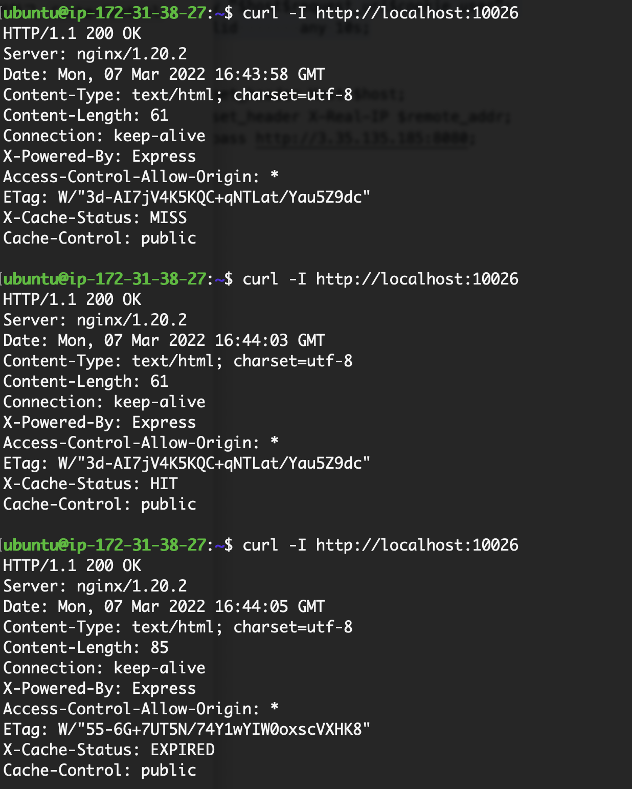

# Sprint - Proxy Server
이번 스프린트에서는 nginx를 통해 아래의 요구사항을 반영한 리버스 프록시(Reverse Proxy) 서버를 작성합니다. nginx는 정적 웹페이지를 호스팅하기 위해서 사용될 뿐만 아니라, 원(origin) 서버의 앞 단에 위치하여, 로드밸런서, 캐싱, 보안 등을 위한 프록시 서버로 사용됩니다.

# Achievement Goals
- 리버스 프록시(Reverse Proxy)와 포워드 프록시(Forward Proxy)에 대해서 이해하고, 특징을 학습합니다.


- 프록시 서버에 사용되는 **지시어**(directives)를 학습하고, 이를 활용합니다.

- 프록시 서버에서 원 서버로 전달되는 요청 헤더를 설정하는 방법을 학습합니다.

- 프록시 서버의 cache-control 방법과 캐시 관련 지시어 사용법을 확인합니다.

# 요구사항
- 내 컴퓨터를 원(origin) 서버의 리버스 프록시 서버로 만들어야 합니다.
- 캐싱 기능을 포함한 프록시 서버를 작성해야 합니다.
- sprint-proxy-server 레포지토리에 Pull Request를 통해, nginx.conf 설정 내용을 제출해야 합니다.

<br>
<br>

# 1. 내 컴퓨터를 원(origin) 서버의 리버스 프록시 서버로 만들기

## 출발

```bash
sudo brew services start nginx
```
## 오류 발생

계속 오류가 나서 conf 파일을 손봤다.  

<br>

## 해결
 
```bash
sudo nginx -t
```
를 통해 nginx status 를 확인하고 문제를 해결할 수 있었다.  
conf 파일을 다음과 같이 수정 ( access_log, error_log 경로를 다시 지정해줬다. )


```
log_format main '$remote_addr - $remote_user [$time_local] "$request" '
                '$status $body_bytes_sent "$http_referer" '
                '"$http_user_agent" "$http_x_forwarded_for"';

access_log /opt/homebrew/var/log/nginx/access.log main;
error_log /opt/homebrew/var/log/nginx/error.log;

server {
    listen       10026;
    server_name  example.com;

    location /some/path/ {
        proxy_set_header Host $host;
        proxy_set_header myname "devops01-name";
        proxy_set_header X-Real-IP $remote_addr;
        proxy_pass  3.39.193.136:8080;
    }
}
```

돌아가는 서비스 확인 가능( 괜히 postgreSQL 돌아가고 있길래 꺼줌)
```bash
brew services list
```


```bash
brew services start nginx

==> Successfully started `nginx` (label: homebrew.mxcl.nginx)
```


제공된 구성에 따라 Nginx 서버는 포트 10026에서 수신 대기하고 모든 수신 요청을 http://3.39.193.136:8080의 지정된 백엔드 서버로 프록시하도록 설정됩니다.  


<br>
<br>

# 2. 프록시 서버에 캐싱 기능 포함하기
프록시된 웹 및 애플리케이션 서버에서 정적 및 동적 콘텐츠를 모두 캐싱하여 클라이언트로의 전달 속도를 높이고 서버의 부하를 줄입니다.  
( 원 서버에 등록한 헤더를 매번 등록하지 않아도 된다는 의미인듯 )

캐싱이 활성화되면 NGINX Plus는 응답을 디스크 캐시에 저장하고 이를 사용하여 매번 동일한 콘텐츠에 대한 요청을 프록시하지 않고도 클라이언트에 응답합니다.

- [nginx caching 공식문서](https://docs.nginx.com/nginx/admin-guide/content-cache/content-caching/) 와 [nginx caching guide](https://www.nginx.com/blog/nginx-caching-guide/) 를 참고하여, 매 요청마다, X-Cache-Status 헤더 값인 MISS, HIT, EXPIRED 를 구현하고, Cache-Control 헤더의 값을 지정할 수 있어야 합니다.
- 캐시 기간은 5초로 지정합니다.
- 매 요청의 결과는 X-Cache-Status 헤더의 값이 아래 스크린샷 값과 같이, MISS ,HIT, EXPIRED와 같은 값이어야 합니다.
- X-Cache-Status의 순서는 MISS, HIT, (5초 후) EXPIRED 순서로 응답이 와야 합니다.


    

## 응답 캐싱 홣성화
1. 먼저 최상위 http{} 컨텍스트에 지시문 포함
```bash

...
http {
...
    
    # Define the "cache" directory
    # 설명 : 캐시된 파일이 저장될 위치를 지정하고 캐시의 최대 크기를 10MB로 설정합니다
    #       (keys_zone=my_cache:10m)

    proxy_cache_path /opt/homebrew/var/cache/nginx levels=1:2 keys_zone=my_cache:10m inactive=5s;

    # Define the server block for the "proxy server"
    # 설명 : server 블록은 프록시 서버에 대한 구성을 정의하고 포트 10027에서 수신 대기합니다.
    server {
        listen       10027;
        server_name  localhost;

    # Define the location block for the "proxy server"
    # 설명 : location / 블록은 프록시 캐시에 대한 구성과 들어오는 요청을 처리하는 방법을 지정합니다.
        location / {
            # "Proxy" the request to the "origin server"
            # 설명 : proxy_set_header 지시어는 업스트림 서버(Host, myname, X-Real-IP)로 보낼 헤더를 설정합니다.
            proxy_set_header Host $host;
            proxy_set_header myname "devops04-SeonghoonKIM";
            # IP 지정
            proxy_set_header X-Real-IP $remote_addr;
            # proxy_pass 지시어는 요청을 전달해야 하는 업스트림 서버를 지정합니다
            # 원서버 지정
            proxy_pass http://3.39.193.136:8080;

            # Set the caching headers
            # 설명 : add_header 지시문은 X-Cache-Status 및 Cache-Control을 포함하여 응답에 헤더를 추가합니다.       
            #       캐시 가져오기 : hit, 못 가져옴 : miss
            add_header X-Cache-Status $upstream_cache_status;

            add_header Content-Type "text/html; charset=utf-8";

            # Enable caching
            # 설명 : proxy_cache 지시문은 캐싱을 활성화하고 캐시 영역(my_cache)을 지정합니다.
            proxy_cache my_cache; # 캐시 이름
            proxy_cache_bypass $http_pragma;
            proxy_cache_revalidate on; # 캐시 응답 검증
            proxy_cache_min_uses 1;
            proxy_cache_lock on;
            proxy_cache_key "$scheme$request_method$host$request_uri";

            proxy_cache_use_stale error timeout invalid_header updating http_500 http_502 http_503 http_504;
            
            # 캐시 유효 시간
            proxy_cache_valid any 5s; # proxy_cache_valid 지시문은 캐시된 항목의 최대 수명을 5초로 설정합니다.       
            # 공용 캐시에 응답 저장
            add_header Cache-Control "public";
        }
    }
}


```