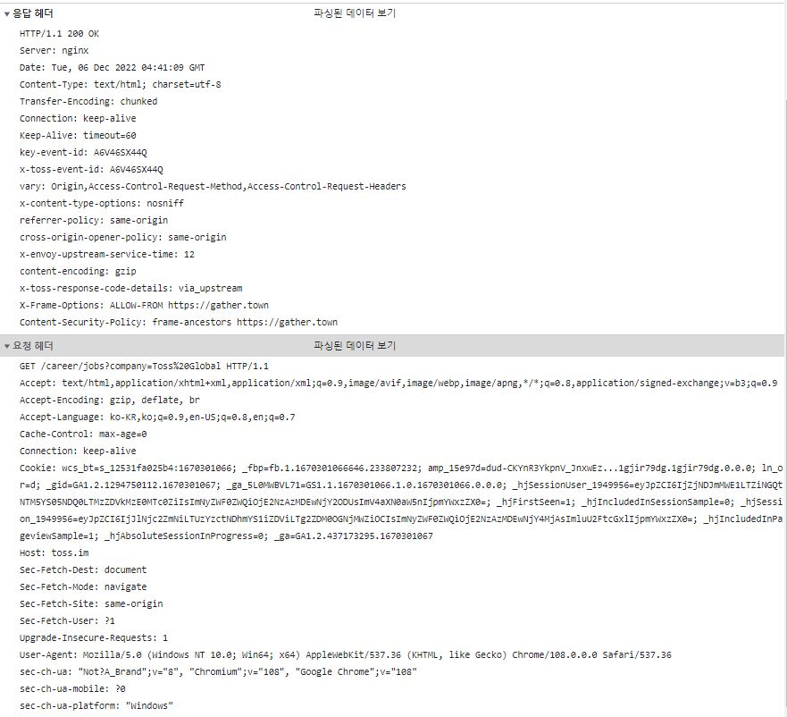

1. 다음의 헤더를 보고 유추할 수 있는 내용을 모두 작성하세요. 



GET /career/jobs? company-Toss%20Global HTTP/1.1  

Accept: text/html,application/xhtml+xml,application/xml;q=0.9,image/avif, image/webp, image/apng,/;q=0.8, application/signed-exchange; v-b3;q=0.9


## 요청 헤더:


- Accept: 클라이언트는 다양한 MIME 유형을 수락하고 일부를 다른 것보다 우선시할 수 있습니다.
- Accept-Encoding: 클라이언트는 gzip, deflate 또는 brotli 압축을 수락할 수 있습니다.
- Accept-Language: 클라이언트가 선호하는 언어는 한국어입니다.
- Cache-Control: 클라이언트는 캐시된 응답을 수락하지 않고 새로운 요청을 합니다.
- Connection: 클라이언트와 서버 간의 연결이 유지되고 있습니다.
- Cookie: 클라이언트가 요청과 함께 여러 쿠키를 보냈습니다.
- Host: 요청하는 서버의 도메인 이름은 toss.im입니다.
- Sec-Fetch-Dest, Sec-Fetch-Mode,  Sec-Fetch-Site, Sec-Fetch-User: 요청이 시작된 방법과 요청되는 리소스 유형을 지정합니다.
- 업그레이드-비보안-요청: 클라이언트는 비보안 요청을 보안 요청으로 기꺼이 업그레이드합니다.
- User-Agent: 클라이언트가 Windows 10에서 Chrome 브라우저를 사용하고 있습니다.

## 응답 헤더:


- Server: 사용 중인 서버 소프트웨어는 Nginx입니다.
- Date: 서버에서 응답을 보낸 날짜와 시간입니다.
- Content-Type: 응답 본문의 MIME 유형은 "text/html"이고 문자 인코딩은 UTF-8입니다.
- Transfer-Encoding: 응답 본문이 청크 인코딩을 사용하여 전송됩니다.
- Connection: 클라이언트와 서버 간의 연결이 유지되고 있습니다.
- Keep-Alive: 서버는 더 이상 활동이 없으면 연결을 닫기 전에 60초 동안 기다립니다.
- key-event-id, x-toss-event-id: 서버에서 설정한 커스텀 헤더.
- Vary: 지정된 요청 헤더의 값에 따라 응답이 달라질 수 있음을 나타냅니다.
- x-content-type-options: 서버가 응답에 대해 MIME 유형을 유추하지 않도록 지정합니다.
- Referrer-Policy: 브라우저가 요청에 대한 참조자 정보를 처리하는 방법을 지정합니다.
- Cross-Origin-Opener-Policy: 응답에 대한 cross-origin opener 정책을 지정합니다.
- X-Envoy-Upstream-Service-Time: 상향 서비스가 요청을 처리하는 데 걸리는 시간을 나타냅니다.
- Content-Encoding: 응답 본문이 gzip을 사용하여 압축되었음을 나타냅니다.
- x-toss-response-code-details: 응답 코드에 대한 세부 정보를 제공합니다.
- X-Frame-Options: 응답이 지정된 출처의 프레임에 표시되도록 지정합니다.
- Content-Security-Policy: 응답에 대한 콘텐츠 보안 정책을 지정합니다.

2. 리눅스에서 ifconfig 명령의 결과를 먼저 살펴보세요. 결과 중 lo0와 en의 차이가 뭘까요? ifconfig에서 ether, inet6, inet은 무엇을 의미하나요?

Linux의 ifconfig 명령은 시스템의 네트워크 인터페이스 구성을 표시합니다. 다음은 출력 예입니다.


```yaml
Copy code
en0: flags=8863<UP,BROADCAST,SMART,RUNNING,SIMPLEX,MULTICAST> mtu 1500
        ether xx:xx:xx:xx:xx:xx 
        inet6 fe80::ca60:7eff:fe57:9007%en0 prefixlen 64 secured scopeid 0x4 
        inet x.x.x.x netmask 0xffffff00 broadcast x.x.x.x
        nd6 options=201<PERFORMNUD,DAD>
        media: autoselect
        status: active
lo0: flags=8049<UP,LOOPBACK,RUNNING,MULTICAST> mtu 16384
        options=1203<RXCSUM,TXCSUM,TXSTATUS,SW_TIMESTAMP>
        inet6 ::1 prefixlen 128 
        inet 127.0.0.1 netmask 0xff000000 
        inet6 fe80::1%lo0 prefixlen 64 scopeid 0x1 
        nd6 options=201<PERFORMNUD,DAD>
```
이 출력에서 ​​en0 및 lo0은 모두 네트워크 인터페이스입니다. 'en0'은 일반적으로 macOS 시스템의 기본 네트워크 인터페이스이며 로컬 네트워크 또는 인터넷에 연결하는 데 사용됩니다. 'lo0'은 동일한 시스템 내에서 통신하는 데 사용되는 특수 루프백 인터페이스입니다.


출력의 필드는 다음과 같은 의미를 갖습니다.


- ether: 인터페이스의 MAC 주소
- inet6: 인터페이스의 IPv6 주소
- inet: 인터페이스의 IPv4 주소


이 예제 출력에서 ​​en0에는 IPv4 주소(inet x.x.x.x)와 IPv6 주소(inet6 fe80::ca60:7eff:fe57:9007%en0)가 있습니다. lo0에는 IPv4 주소(inet 127.0.0.1)만 있습니다.


# References
과제 1 : Linux의 ifconfig에 있는 루프백 인터페이스(lo) 및 이더넷 인터페이스(en)에 대한 자세한 내용은 인터페이스에 대한 Linux 설명서를 참조하십시오. <https://www.kernel.org/doc/html/latest/networking /device_drivers/netdevice.html>

과제 2 : ether, inet 및 inet6을 포함하여 ifconfig의 다양한 플래그에 대한 정보는 Linux의 ifconfig 매뉴얼 페이지를 참조할 수 있습니다. <https://man7.org/linux/man-pages/man8/ifconfig.8 .html>