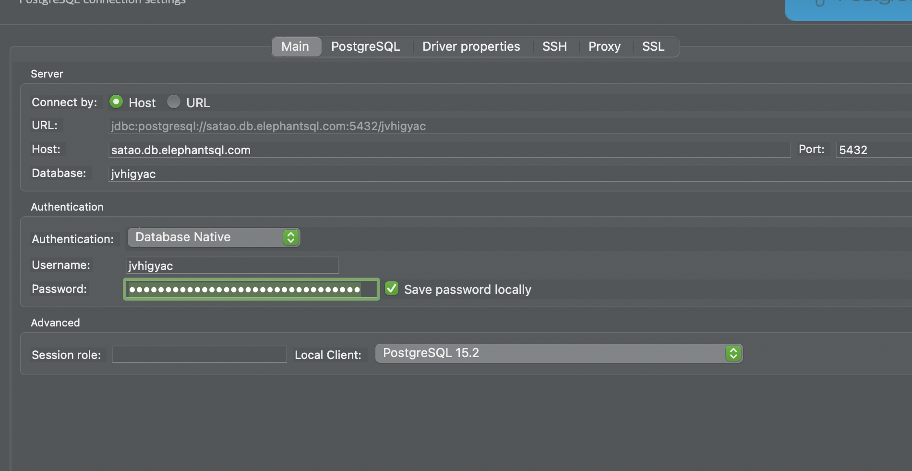

# 목표
- API 문서를 작성할 수 있습니다.
- Fastify를 이용해 DB와 통신하는 서버를 만들 수 있습니다.
- PostgreSQL을 이용하여 DB를 구성할 수 있습니다.
- GitHub을 활용하여 팀원들과 협업합니다.
    - 관계형데이터베이스를 위한 데이터를 모델링하고, API 문서화를 진행합니다.
    - CRUD 기능을 가진 한개의 API 서버를 완성합니다.
    - 클라우드 서비스 데이터베이스를 사용하여 데이터를 영속적으로 저장합니다.
    - Git을 이용한 협업을 진행합니다

# Advanced
- 주어진 기능 명세 외에 필요하다고 생각되는 명세를 추가로 개발합니다.
- 선택한 주제 외에 API 서버를 추가 완성합니다.
- 관계형 데이터베이스와 NoSQL의 차이를 이해하고, 관계형 데이터베이스 및 NoSQL이 어떤 경우에 적합한지 이해합니다.

# 제작 범위 및 기술 스택
- 백엔드를 만듭니다.
- Fastify를 사용합니다.
- 데이터베이스를 사용해야 합니다. 즉, 데이터 모델을 디자인해야 합니다.
- Entity-Relationship Diagram (ERD)을 그려야 합니다.
    - https://dbdiagram.io/home
- API 문서를 만들어야 합니다.
    - Method, Endpoint, Request, Response가 예시와 함께 포함되어야합니다.
---

팀의 레포를 포크한 https://github.com/Hoonology/Devops-04-S1-Team3.git 를 로컬에 저장한다.
- ```git checkout hoonology```


# 

상호 간 레포지토리를 리모트 해야한다.

- git remote add pair3 https://github.com/seay0/Devops-04-S1-Team3.git
- teddykim@Hoonology ~/Devops-04-S1-Team3 ‹main●›  
 ╰─$ git remote -v
```bash
origin	https://github.com/Hoonology/Devops-04-S1-Team3.git (fetch)
origin	https://github.com/Hoonology/Devops-04-S1-Team3.git (push)
pair2	https://github.com/teddy-woo/Devops-04-S1-Team3.git (fetch)
pair2	https://github.com/teddy-woo/Devops-04-S1-Team3.git (push)
pair3	https://github.com/seay0/Devops-04-S1-Team3.git (fetch)
pair3	https://github.com/seay0/Devops-04-S1-Team3.git (push)
```
pull을 땡겨올건데,
깃허브 설정 들어가서 서로 collaborators and teams에서 어드민 권한을 다 줘야한다.

간단!

- GET/ USER_data
```json
    // 요청
    GET /USER_data HTTP/1.1
    Host: example.com

    // 정상 응답
    HTTP/1.1 200 OK
    Content-Type: application/json

    [
    {
            "user_id": 1,
            "username": "kim",
            "is_seller": true
    },
        {
            "user_id": 2,
            "username": "park",
            "is_seller": false
    }
    ]    
```
- POST /USER_data
```json
    // 요청
    POST /USER_data HTTP/1.1
    Host: example.com
    Content-Type: application/json
    Authorization: Bearer <access_token_here>

        {
            "user_id": 3,
            "username": "lee",
            "is_seller": true
        }
    // 정상 응답
    HTTP/1.1 201 Created
    Content-Type: application/json

        {
            "user_id": 3,
            "username": "lee",
            "is_seller": true
        }

```


- GET/ITEMS
```json
    // 요청
    GET /ITEMS HTTP/1.1
    Host: example.com

    { "user": "kimcoding" }


    // 정상 응답
    HTTP/1.1 200 OK
    Content-Type: application/json

    [
    {
        "item_id": "1",
        "item_name": "socks",
        "category": "clothing",
        "brand": "Nike",
        "price": 100
    },
    {
        "item_id": "2",
        "item_name": "T-shirt",
        "category": "Clothing",
        "brand": "Yonex",
        "price": 550
    }
    ]

    // 오류 응답
    HTTP/1.1 400
        { 
        "message": "Nope",
        }
```
- GET /ITEMS/${ITEM_ID}
```json
    // 요청
    GET /ITEMS/1 HTTP/1.1
    Host: example.com

    // 정상 응답
    HTTP/1.1 200 OK
    Content-Type: application/json

    {
        "item_id": "1",
        "item_name": "socks",
        "category": "clothing",
        "brand": "Nike",
        "price": 100
    }
```
- POST/POST_ITEMS
```json   
    // 요청
    POST /POST_ITEMS HTTP/1.1
    Host: example.com
    Content-Type: application/json
    Authorization: Bearer <access_token_here>

    {
        "category": "category3",
        "brand": "Adidas",
        "price": 300,
        "item_name": "adidas"
    }
    // 정상 생성
    HTTP/1.1 201 Created
    Content-Type: application/json
    {
        "category": "category3",
        "brand": "Adidas",
        "price": 300,
        "item_name": "adidas"
    }

```
- POST/CART
```json   
    // 요청
    POST /CART HTTP/1.1
    Host: example.com
    Content-Type: application/json
    Authorization: Bearer <access_token_here>

    {
        "user_id": 1,
        "item_id": 1,
        "item_cnt": 2
    }

    // 정상 생성
    HTTP/1.1 201 Created
    Content-Type: application/json

    {
        "cart_id": 1,
        "user_id": 1,
        "item_id": 1,
        "item_cnt": 2
    }

```
- GET /CART/${USER_ID}


```json   
    // 요청
    GET /CART/1 HTTP/1.1
    Host: example.com
    Authorization: Bearer <access_token_here>

    // 정상 응답
    HTTP/1.1 200 OK
    Content-Type: application/json

[
  {
        "cart_id": 1,
        "user_id": 1,
        "item_id": 1,
        "item_cnt": 2
  },
  {
        "cart_id": 2,
        "user_id": 1,
        "item_id": 2,
        "item_cnt": 1
    }
]
```
- PUT /CART

```json   
    // 요청
    PUT /CART HTTP/1.1
    Host: example.com
    Content-Type: application/json

    {
        "user_id": 1,
        "item_id": 1,
        "item_cnt": 3
    }


    // 정상 응답
    HTTP/1.1 200 OK
    Content-Type: application/json

HTTP/1.1 200 OK
Content-Type: application/json

    {
        "cart_id": 1,
        "user_id": 1,
        "item_id": 1,
        "item_cnt": 3
    }
```

- DELETE /CART
```json
    // 요청
    DELETE /CART/1/ITEMS/2 HTTP/1.1
    Host: example.com
    Authorization: Bearer <access_token>

    // 정상 응답
    HTTP/1.1 204 No Content
```


# DB 생성
버전 확인  
```postgres -V```

DB 생성
```bash
createdb your_database_name
```
DB 목록 확인
```bash
psql -l
```
DB 연결
```bash
psql your_database_name
```

## DBeaver에서 ElephantSQL 연결
ElephantSQL에서 인스턴스를 생성하고, DBeaver로 연결한다.



## ...
```.env``` 파일에
```bash
HOSTNAME=satao.db.elephantsql.com
USERNAME=jvhigyac
PASSWORD=4uSs-7B21LIZfI17Fzf1acdcJCG87ke
DATABASE=jvhigyac
```
를 shoping-bag 폴더에 넣고 Push 해주자

