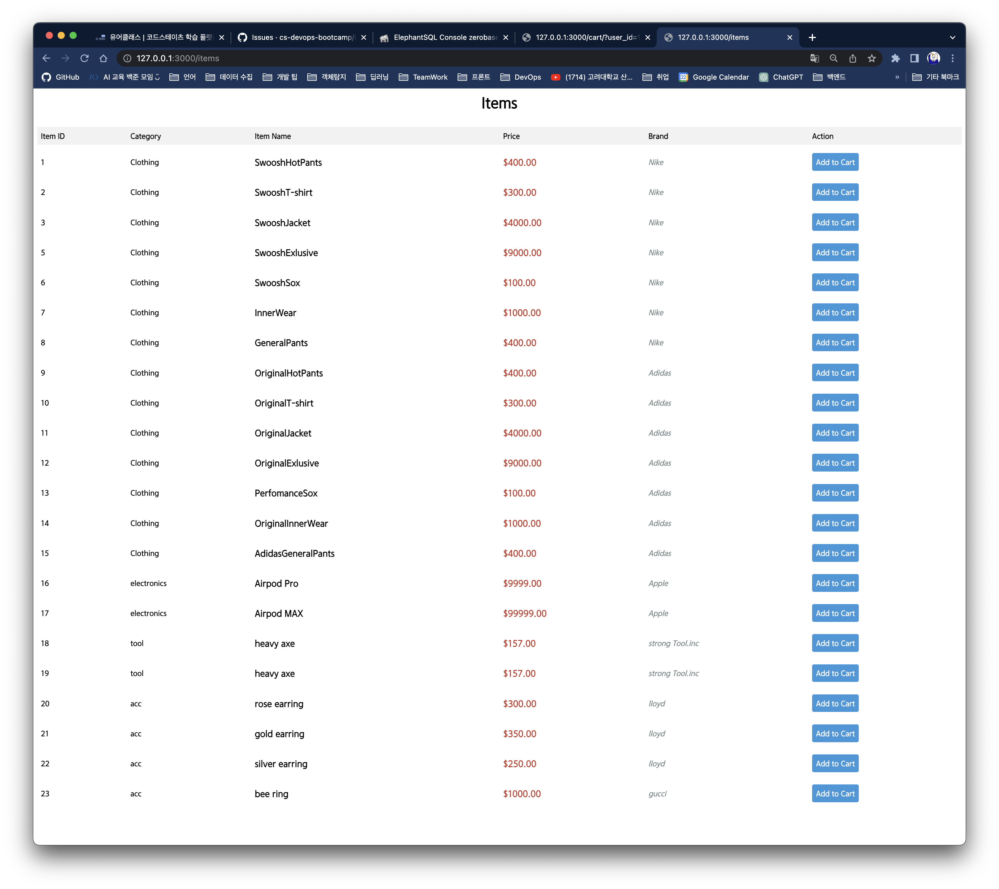

# Day 2
# INDEX & Goals
- [Fastify를 이용해 DB와 통신하는 서버 만들기](#fastify를-이용해-db와-통신하는-서버-만들기)
    - [1. ```.env``` 파일 작성](#1-우선-elephantsql의-연결-정보를-env-파일에-작성한다)
    - [2. fastify 프로젝트 생성](#fastify-프로젝트-생성)
- [WAS와 데이터베이스 연결](#was와-데이터베이스-연결)
- [CRUD 구현](#crud-구현)
  - [엔드포인트 구분](#엔드포인트-구분)
---
### 쇼핑몰 요구사항
- [✔] [사용자는 모든 상품을 조회할 수 있다]
- [✔] [사용자는 특정 분류의 상품을 조회할 수 있다(상품분류, 브랜드명, 가격, 상품명)] 
- [✔] [사용자의 타입이 판매자인 경우 자신의 상품을 등록할 수 있다 ]
- [✔] [사용자는 상품을 장바구니에 담을 수 있다]
- [✔] [사용자는 자신의 장바구니를 조회할 수 있다]
- [✔] [사용자는 자신의 장바구니에 있는 상품의 수량을 변경시킬 수 있다]
- [✔] [사용자는 상품을 자신의 장바구니에서 제외할 수 있다]
---
## Fastify를 이용해 DB와 통신하는 서버 만들기
### 1. 우선 ElephantSQL의 연결 정보를 ```.env``` 파일에 작성한다.
  ```bash
  HOSTNAME=satao.db.elephantsql.com
  USERNAME=jvhigyac
  PASSWORD=4uSs-7B21LIZfI17Fzf1acdcJCG87ke
  DATABASE=jvhigyac
  ```
> shoping-bag 폴더에 저장 후 Push 

<br>

### 2. fastify 프로젝트 생성

```bash
npm install -g fastify-cli
```  
shopping-bag 폴더 안에
```
fastify generate shopping-bag
```
shopping-bag 폴더 접근
```bash
cd shopping-bag
# 디펜던시 설치
npm i # node_modules 폴더가 생성된다. 
```
3000번 포트를 통해 WAS 접근한다.
```bash
npm run dev
# 다른 프로세스가 3000번 포트가 연결되어 있을 경우,  
# npm run dev -- --port 3001을 실행하여 3000 대신 포트 3001에서 서버를 시작합니다.
```

## WAS와 데이터베이스 연결

https://github.com/fastify/fastify-postgres 참고
- ```postgres.js``` 파일 내용 (향후 수정 내용)
```bash
fastify.register(require('@fastify/postgres'), {
  connectionString: 'postgres://postgres@localhost/postgres'
})
```

환경변수로 불러오기
``` js
const {
  DATABASE_USER,
  DATABASE_PASSWORD,
  DATABASE_HOST,
  DATABASE_NAME } = process.env
```

위에서 불러온 ```postgres.js```를 아래와 같이 수정 
```js
module.exports = fp(async function (fastify, opts) {
fastify.register(require('@fastify/postgres'), {
connectionString: `postgres://${DATABASE_USER}:${DATABASE_PASSWORD}@${DATABASE_HOST}/${DATABASE_NAME}}`
})
```
---
## CRUD 구현

### 엔드포인트 구분
우리가 직접 구현할 엔드포인트는 3가지로,  ```users```, ```items```, ```cart```가 있다.  
선행으로 ElephantSQL에 아래 쿼리문들을 작성하여 DB 작업을 진행한다.

  - 테이블 생성 ***CREATE***
       ``` sql
    DROP TABLE IF EXISTS public.users;

    CREATE TABLE public.users (
              user_id integer NOT NULL,
              user_name integer NOT NULL,
              is_seller boolean NOT NULL,
              CONSTRAINT users_id_pk PRIMARY KEY (user_id)
	    );
    ```
    ``` sql
    DROP TABLE IF EXISTS public.items;

    CREATE TABLE public.items (
	          item_id integer NOT NULL,
	          category varchar NOT NULL,
              brand varchar NOT NULL,
              price integer NOT NULL,
              item_name varchar NOT NULL,
              CONSTRAINT items_id_pk PRIMARY KEY (item_id)
	    );
    ```
    ``` sql
    DROP TABLE IF EXISTS public.cart;

    CREATE TABLE public.cart (
	          cart_id varchar NOT NULL,
	          user_id integer NOT NULL,
              item_id integer NOT NULL,
              item_cnt integer NOT NULL,
              CONSTRAINT cart_id_pk PRIMARY KEY (cart_id)
	    );
    ```
    


  - 항목 추가 ***INSERT INTO***
    ``` sql
      INSERT INTO users (user_id, username, is_seller)  
      VALUES (2580, 'Dohyun', false);
      INSERT INTO users (user_id, username, is_seller)  
      VALUES (1220, 'Seoyeon', true);
      INSERT INTO users (user_id, username, is_seller)  
      VALUES (3006, 'Seonghoon', false);
      ``` 
      ```sql
        INSERT INTO items (item_id, price, category, brand, item_name)  
        VALUES (1,400,'Clothing','Nike','SwooshHotPants');
        INSERT INTO items (item_id, price, category, brand, item_name)  
        VALUES (2,300,'Clothing','Nike','SwooshT-shirt');
      ```
  
#### /items : 상품 목록   
- GET


   ```js
    const fastify = require('fastify')();

    module.exports = async function(fastify, ops) {
      fastify.get('/', async function(request, reply) {

        const client = await fastify.pg.connect();
        try {
          const { rows } = await client.query(
            'SELECT * FROM items'
          )
          reply.code(200).send(rows)
        } finally {
          client.release()
        }
      })
    }
   ``` 

> fastify를 통해 GET 을 구현하기 위해 위와 같은 코딩을 하고,   
html 및 css 작업을 통해 (생략)  
localhost:3000/items에 접근 시 프론트로 작업된 화면이 보여지게 했다.

- POST (Authorization)
먼저, 판매자에게 토큰을 부여해주는 코드를 만들어보면,
```js
module.exports = {
    //aaa는 유저1, bbb는 유저2로 가정 
    tokenValidator: (token) => {
        let result;
        if (token === "Bearer aaa") { 
            result = false;
            // userId 1()은 DB 에서 구매자 (is_seller = false)
        } else if (token === "Bearer bbb") {
            result = true;
            // userId 2(시연님)은 DB 에서 판매자 (is_seller = true)
        } else if (token === "Bearer ccc") {
            result = false;
            // userId 3()은 DB 에서 구매자 (is_seller = false)
        } 
        return result
    }
}
```
is_seller 가 True인(판매자) 오시연만 ```Bearer bbb``` 토큰을 받게 된다.
> 현재 users 인원은 3명으로, 판매자는 1명이라는 전제 하에 토큰을 1개만 만들었다.

```js
const fastify = require('fastify')();

const { tokenValidator } = require("../controller/tokenValidator")

module.exports = async function(fastify, ops) {
  fastify.post('/', async function (request, reply) {
    try{ 
      const client = await fastify.pg.connect()
      let check_seller = tokenValidator(request.headers.authorization);
      
      if ( check_seller === 1220) {
         // console.log(check_seller); // 1220
        const { rows } = await client.query(
          `INSERT INTO items (item_id, category, brand, price, item_name)
          VALUES ('${request.body.item_id}','${request.body.category}','${request.body.brand}', '${request.body.price}', '${request.body.item_name}')`
        )
        reply.code(201).send('성공적으로 등록되었습니다!');
      }   
      else {
        console.log("Bed Request");
        
      }
    }
    catch(error) {
      //잘못된 유저 에러
      console.log("판매자만 상품을 등록할 수 있습니다!");
      reply.code(401).send('Un authorized');
    }
  });
}

```
check_seller - tokenValidator에 boolean 값을 넣고, 판매자의 토큰 값이면 ```201 code```로  POST를 성공 시킨다.


(좌) 400 Bad Request 응답  (우) 201 Created 응답

---

<br>

#### /cart : 장바구니   


  


